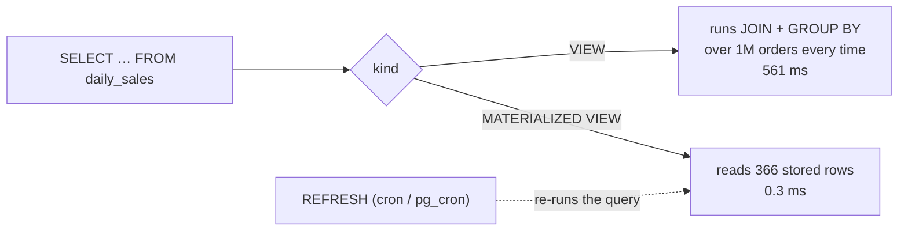
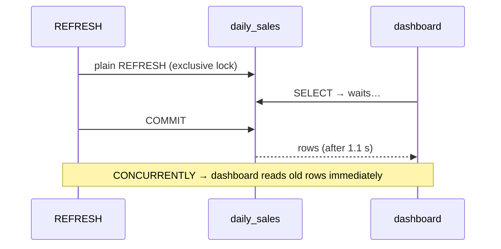

# Views & Materialized Views

> **Definition:**
> - **View** = a **saved query** with a name. Selecting from it runs the query again, every time. It stores no data.
> - **Materialized view** = a saved **result**: the query runs once and its rows are stored on disk like a table. Fast to read, but only as fresh as the last `REFRESH`.



## 1. View: simplify and protect

```sql
CREATE VIEW user_public AS
SELECT id, name, country FROM users;          -- no email

SELECT * FROM user_public ORDER BY id LIMIT 2;
--  1 | User 1 | SA
--  2 | User 2 | AE
```

The view is expanded into the query, so indexes still work:
```sql
EXPLAIN SELECT * FROM user_public WHERE id = 42;
-- Index Scan using users_pkey on users
--   Index Cond: (id = 42)
```

### Security: expose columns, not the table (measured)

```sql
CREATE ROLE web NOLOGIN;
GRANT SELECT ON user_public TO web;           -- the view only, not users

SET ROLE web;
SELECT * FROM user_public WHERE id = 42;      -- ✅ 42 | User 42 | JO
SELECT email FROM users WHERE id = 42;        -- ❌ ERROR: permission denied for table users
```

### Simple views are updatable

```sql
UPDATE user_public SET name = 'Renamed' WHERE id = 42 RETURNING *;
--  42 | Renamed | JO        ← written to users
```
A view on one table without `GROUP BY`/`DISTINCT`/joins accepts `INSERT/UPDATE/DELETE`.

## 2. Materialized view: precomputed report (measured)

**Scenario:** dashboard "orders and revenue per day", 1M orders.

```sql
CREATE MATERIALIZED VIEW daily_sales AS
SELECT o.created_at::date AS day,
       count(*)             AS orders,
       sum(o.qty * p.price) AS revenue
FROM orders o JOIN products p ON p.id = o.product_id
WHERE o.status <> 'cancelled'
GROUP BY 1;
-- SELECT 366       (366 rows, 32 kB)

CREATE UNIQUE INDEX ON daily_sales (day);      -- fast lookups + needed for CONCURRENTLY
```

| Read the last 3 days | Time |
|---|---|
| from the plain view `daily_sales_v` | 561 ms |
| from the materialized view | **0.32 ms** (~1,750×) |
| one day by index: `WHERE day = '2026-09-30'` | 0.32 ms |

## 3. Staleness and refresh (measured)

```sql
INSERT INTO orders (user_id, product_id, qty, status, created_at)
VALUES (1, 1, 5, 'paid', '2026-09-30 12:00');

SELECT orders FROM daily_sales   WHERE day = '2026-09-30';   -- 1982  ← stale
SELECT orders FROM daily_sales_v WHERE day = '2026-09-30';   -- 1983  ← view is always current

REFRESH MATERIALIZED VIEW daily_sales;                       -- 535 ms (re-runs the query)
SELECT orders FROM daily_sales   WHERE day = '2026-09-30';   -- 1983  ✅
```

### `REFRESH` vs `REFRESH … CONCURRENTLY` (measured, 2 sessions)

A dashboard reads the view while a refresh runs:

| Refresh mode | Reader's `SELECT count(*) FROM mv` | Why |
|---|---|---|
| `REFRESH MATERIALIZED VIEW mv` | **waited 1,092 ms** | exclusive lock until the refresh commits |
| `REFRESH MATERIALIZED VIEW CONCURRENTLY mv` | **0.65 ms** | builds new rows aside, then applies the diff |



`CONCURRENTLY` needs a **unique index** on the materialized view and is a bit slower to run (552 vs 535 ms here). Use it whenever someone may be reading.

Schedule it:
```sql
-- pg_cron extension: every 10 minutes
SELECT cron.schedule('refresh-daily-sales', '*/10 * * * *',
                     'REFRESH MATERIALIZED VIEW CONCURRENTLY daily_sales');
```

## 4. Compare

| | VIEW | MATERIALIZED VIEW | Table + trigger/job |
|---|---|---|---|
| Stores rows | ❌ | ✅ | ✅ |
| Freshness | always current | as of last `REFRESH` | you maintain it |
| Read speed | = the query (561 ms) | ⚡ (0.3 ms) | ⚡ |
| Indexes | ❌ (uses base table's) | ✅ | ✅ |
| Refresh cost | — | whole query each time | incremental |
| Use for | hiding columns, reusing joins | dashboards, reports that may lag minutes | real-time counters |

## Key Points
- View = named query, no storage, always fresh, indexes on base tables still used
- Grant on a view to hide columns of the base table
- Materialized view = stored result: 561 ms → 0.3 ms, but stale until `REFRESH`
- `REFRESH … CONCURRENTLY` (needs a unique index) doesn't block readers (1.1 s wait → 0.65 ms)
- Schedule refreshes with cron / `pg_cron`

Next → [03-extensions](03-extensions.md)
