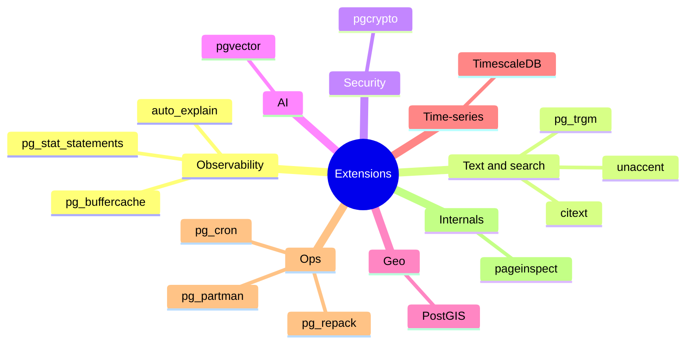

# Extensions

> **Definition:** an **extension** is a package of new types, functions, operators, index methods or background workers that plugs into PostgreSQL with one command, `CREATE EXTENSION name;`. No fork of the engine is needed. Many ship with PostgreSQL (`contrib`). Others need their own packages or Docker image.



## 1. What's available here (measured, `postgres:17`)

```sql
SELECT count(*) FROM pg_available_extensions;   -- 45 ship with the image
\dx                                             -- installed in this database
--  pg_stat_statements | 1.11
--  plpgsql            | 1.0
```

| Command | Does |
|---|---|
| `SELECT * FROM pg_available_extensions;` | what can be installed on this server |
| `\dx` | what is installed in the current database |
| `CREATE EXTENSION x;` | install into the current database (per database!) |
| `ALTER EXTENSION x UPDATE;` | upgrade after a server package update |
| `DROP EXTENSION x;` | remove (fails if objects depend on it) |

Some extensions must also be **preloaded** at server start (they hook into the engine):
```sql
SHOW shared_preload_libraries;   -- pg_stat_statements   (set in docker-compose.yml `command:`)
```

## 2. pg_stat_statements: which queries cost the most (measured)

**Definition:** records every statement's normalized text (constants → `$1`), call count and total/mean time.

```sql
SELECT round(total_exec_time) AS total_ms, calls,
       round(mean_exec_time::numeric, 2) AS avg_ms,
       left(query, 60) AS query
FROM pg_stat_statements
ORDER BY total_exec_time DESC LIMIT 5;
```
```text
 total_ms | calls  |  avg_ms  | query
    72160 | 531801 |     0.14 | SELECT o.id, p.name, o.qty, o.created_at FROM orders o JOIN …
    14412 |      1 | 14411.52 | INSERT INTO events (user_id, type, created_at) SELECT g % $1 …
    12839 |      2 |  6419.41 | CREATE INDEX items_title_fts ON items USING gin (to_tsvector …
```

Reading it: the top query is fast (0.14 ms) but ran 531,801 times → it costs the most in total. Optimizing it by 10% saves more than fixing the 14-second one-off.

| Sort by | Finds |
|---|---|
| `total_exec_time` | biggest total load → optimize first |
| `mean_exec_time` | slowest single calls |
| `calls` | chatty code (N+1 queries) |

Reset: `SELECT pg_stat_statements_reset();`

## 3. Small, useful contrib extensions (measured)

### `unaccent`: search ignoring accents

```sql
CREATE EXTENSION unaccent;
SELECT unaccent('Crème Brûlée Café');   -- Creme Brulee Cafe
```

### `citext`: case-insensitive text type

```sql
CREATE EXTENSION citext;
CREATE TABLE acc (email citext UNIQUE);
INSERT INTO acc VALUES ('Ali@Shop.test');
INSERT INTO acc VALUES ('ali@shop.test');
-- ERROR:  duplicate key value violates unique constraint "acc_email_key"   ← same email, different case
SELECT * FROM acc WHERE email = 'ALI@SHOP.TEST';
--  Ali@Shop.test                                                         ← original case kept
```
Alternative without an extension: `UNIQUE` index on `lower(email)` ([expression index](../05-indexes-performance/04-partial-covering.md#3-expression-index)).

### `pg_buffercache`: what's in RAM right now

```sql
CREATE EXTENSION pg_buffercache;
SELECT c.relname, count(*) AS buffers, pg_size_pretty(count(*) * 8192) AS cached
FROM pg_buffercache b JOIN pg_class c ON b.relfilenode = pg_relation_filenode(c.oid)
WHERE b.reldatabase = (SELECT oid FROM pg_database WHERE datname = current_database())
GROUP BY c.relname ORDER BY 2 DESC LIMIT 5;
--       relname       | buffers | cached
--  orders             |    9349 | 73 MB      ← the whole table is in shared_buffers
--  orders_user_id_idx |    1136 | 9088 kB
--  users              |    1026 | 8208 kB
```

### `pgcrypto`: hashing in SQL

```sql
CREATE EXTENSION pgcrypto;
SELECT crypt('secret', gen_salt('bf'));        -- $2a$06$…  (bcrypt)
SELECT crypt('secret', stored_hash) = stored_hash;   -- verify
```

### Others used in this repo

| Extension | Used in |
|---|---|
| `pg_trgm` | `LIKE '%x%'` indexes ([index types](../05-indexes-performance/03-index-types.md#34-trigram-pg_trgm--like-text)) |
| `btree_gist` | exclusion constraints with `=` + ranges ([index types](../05-indexes-performance/03-index-types.md#41-ranges--exclusion-constraint-no-double-booking)) |
| `pageinspect` | look inside pages ([storage layout](../00-introduction/04-storage-layout.md)) |

## 4. Extensions that need another image

| Need | Extension | Docker image |
|---|---|---|
| Vector / semantic search | `pgvector` | `pgvector/pgvector:pg17` |
| Geography, distances in km | `PostGIS` | `postgis/postgis:17-3.5` |
| Time-series, compression | `TimescaleDB` | `timescale/timescaledb:latest-pg17` |
| Scheduled jobs inside PG | `pg_cron` | build or a cloud provider |

### pgvector example

> Not runnable on `postgres:17`: `vector` isn't in the 45 available extensions above. Switch the compose image to `pgvector/pgvector:pg17` first.

```sql
CREATE EXTENSION vector;
CREATE TABLE docs (id bigserial PRIMARY KEY, body text, embedding vector(3));
INSERT INTO docs (body, embedding) VALUES
  ('cat', '[1,0,0]'), ('dog', '[0.9,0.1,0]'), ('car', '[0,0,1]');
CREATE INDEX ON docs USING hnsw (embedding vector_cosine_ops);

SELECT body FROM docs ORDER BY embedding <=> '[1,0,0]' LIMIT 2;   -- cat, dog
```
`<=>` = cosine distance. Real embeddings have 384–3072 dimensions, produced by an ML model.

## 5. Pitfalls

| ❌ | ✅ |
|---|---|
| `CREATE EXTENSION pg_stat_statements` without `shared_preload_libraries` | add it to the server config / compose `command:` and restart |
| installed in `shop`, used in `shop_test` | `CREATE EXTENSION` per database |
| upgrade server package, forget the extension | `ALTER EXTENSION x UPDATE;` |
| managed cloud DB | only the provider's allow-listed extensions |

## Key Points
- `CREATE EXTENSION` per database; 45 ship with `postgres:17`
- Preload-type extensions need `shared_preload_libraries` + restart
- `pg_stat_statements`: sort by `total_exec_time` to find what to optimize
- `citext`, `unaccent`, `pgcrypto`, `pg_buffercache` = cheap wins
- pgvector / PostGIS / TimescaleDB → change the Docker image

Next → [04-full-text-search](04-full-text-search.md)
