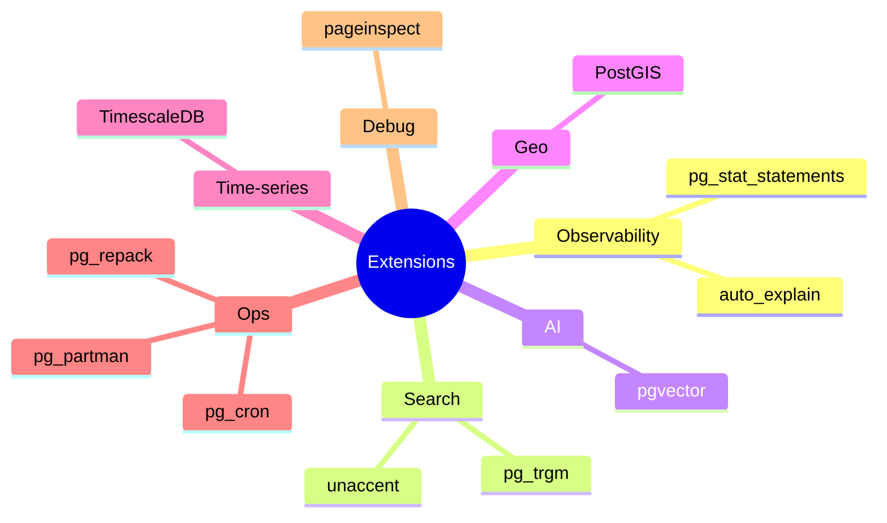

# Extensions

> Postgres is a platform. Extensions add types, indexes, and functions without forking the engine.



## Must-have: pg_stat_statements

```sql
-- enabled in this repo's compose (shared_preload_libraries)
SELECT round(total_exec_time) AS total_ms, calls,
       round(mean_exec_time::numeric, 2) AS avg_ms,
       left(query, 60) AS query
FROM pg_stat_statements
ORDER BY total_exec_time DESC LIMIT 5;

SELECT pg_stat_statements_reset();
```

## pgvector — semantic search

```sql
-- needs image: pgvector/pgvector:pg17
CREATE EXTENSION vector;
CREATE TABLE docs (id bigserial PRIMARY KEY, body text, embedding vector(3));
INSERT INTO docs (body, embedding) VALUES ('cat', '[1,0,0]'), ('dog', '[0.9,0.1,0]'), ('car', '[0,0,1]');
CREATE INDEX ON docs USING hnsw (embedding vector_cosine_ops);
SELECT body FROM docs ORDER BY embedding <=> '[1,0,0]' LIMIT 2;   -- cat, dog
```

## Commands

| Command | |
|---|---|
| `SELECT * FROM pg_available_extensions;` | available |
| `\dx` | installed |
| `CREATE EXTENSION x;` | install |
| `ALTER EXTENSION x UPDATE;` | upgrade |

## Images

| Need | Docker image |
|---|---|
| Vanilla | `postgres:17` |
| pgvector | `pgvector/pgvector:pg17` |
| PostGIS | `postgis/postgis:17-3.5` |
| TimescaleDB | `timescale/timescaledb:latest-pg17` |

## Pitfall
❌ `CREATE EXTENSION pg_stat_statements` without `shared_preload_libraries` → collects nothing
✅ Add it to `command` and restart the container

Next → [04-full-text-search](04-full-text-search.md)
