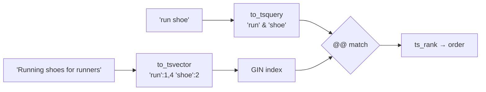

# Full-Text Search

> Word search with stemming and ranking, no Elasticsearch — enough for most apps.



## Example

```sql
CREATE TABLE articles (
    id    bigint GENERATED ALWAYS AS IDENTITY PRIMARY KEY,
    title text,
    body  text,
    search tsvector GENERATED ALWAYS AS (
        setweight(to_tsvector('english', coalesce(title, '')), 'A') ||
        setweight(to_tsvector('english', coalesce(body,  '')), 'B')
    ) STORED
);
CREATE INDEX articles_search_idx ON articles USING gin (search);

INSERT INTO articles (title, body) VALUES
  ('Running shoes guide', 'Best shoes for runners in 2026'),
  ('Postgres indexing',   'B-Tree, GIN and BRIN explained');

SELECT title, ts_rank(search, q) AS rank
FROM articles, websearch_to_tsquery('english', 'running shoe') q
WHERE search @@ q
ORDER BY rank DESC;
--  Running shoes guide | 0.99643415   (measured)
```

## FTS vs LIKE vs Elasticsearch

| | `LIKE '%x%'` | Postgres FTS | Elasticsearch |
|---|---|---|---|
| Stemming (run/running) | ❌ | ✅ | ✅ |
| Ranking | ❌ | ✅ | ✅✅ |
| Typos | ❌ (pg_trgm ✅) | ❌ | ✅ |
| Extra infrastructure | — | — | a whole cluster |

## Key Points
- `websearch_to_tsquery` = Google-like syntax
- Generated column + GIN
- Arabic: `simple` config or an external extension

Lab → [labs/09-ecosystem.sql](../../labs/09-ecosystem.sql)

Next → [10-plpgsql/01-basics](../10-plpgsql/01-basics.md)
