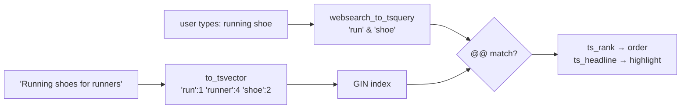

# Full-Text Search

> **Definition:** full-text search (FTS) finds documents by **words**, not by exact characters. Text is turned into a `tsvector` (normalized words called **lexemes**, with positions), a search into a `tsquery`, and `@@` tests whether they match. It handles word forms ("running" = "run"), ignores filler words, ranks results, and uses a GIN index. No Elasticsearch needed for most apps.



## 1. Text → lexemes (measured)

```sql
SELECT to_tsvector('english', 'Running shoes for runners');
--  'run':1 'runner':4 'shoe':2
```

| Input word | Lexeme | What happened |
|---|---|---|
| Running | `run` | lower-cased + **stemmed** |
| shoes | `shoe` | plural removed |
| for | — | **stop word**, dropped |
| runners | `runner` | stemmed (a different word from "run") |

The number = word position (used for phrase search and ranking).

The **configuration** (`'english'`) decides the stemming rules:
```sql
SELECT to_tsvector('simple', 'Running shoes for runners');
--  'for':3 'runners':4 'running':1 'shoes':2      ← lower-case only, no stemming

SELECT to_tsvector('arabic', 'الأحذية الرياضية للعدائين');
--  'احذ':1 'رياض':2 'عداء':3                       ← built-in Arabic stemmer
```

## 2. Building a query (measured)

```sql
SELECT to_tsquery('english', 'running & shoe'),
       plainto_tsquery('english', 'running shoes'),
       websearch_to_tsquery('english', '"running shoes" -trail or boots');
--  'run' & 'shoe' | 'run' & 'shoe' | 'run' <-> 'shoe' & !'trail' | 'boot'
```

| Function | Input | Use for |
|---|---|---|
| `to_tsquery` | operator syntax: `&` `\|` `!` `<->` `:*` | your own code |
| `plainto_tsquery` | plain words, all must match | simple search box |
| `websearch_to_tsquery` ✅ | Google-like: `"phrase"`, `-exclude`, `or` | user-facing search box (never errors on bad input) |

## 3. Searchable table + index

```sql
CREATE TABLE articles (
    id     bigint GENERATED ALWAYS AS IDENTITY PRIMARY KEY,
    title  text,
    body   text,
    search tsvector GENERATED ALWAYS AS (
        setweight(to_tsvector('english', coalesce(title, '')), 'A') ||   -- title = weight A
        setweight(to_tsvector('english', coalesce(body,  '')), 'B')      -- body  = weight B
    ) STORED
);
CREATE INDEX articles_search_idx ON articles USING gin (search);

INSERT INTO articles (title, body) VALUES
  ('Running shoes guide', 'Best shoes for runners in 2026'),
  ('Postgres indexing',   'B-Tree, GIN and BRIN explained'),
  ('Marathon training',   'How to start running: shoes, plans and diet'),
  ('Trail running',       'Trail shoes for rocky paths');

SELECT search FROM articles WHERE id = 1;
--  '2026':9B 'best':4B 'guid':3A 'run':1A 'runner':7B 'shoe':2A,5B
```

A **generated column** keeps `search` in sync on every insert/update. The query and the index use the same column, so the expression can't drift (the [`'simple'` vs `'english'` trap](../05-indexes-performance/03-index-types.md#33-full-text-search)).

## 4. Search, rank, highlight (measured)

```sql
SELECT title, round(ts_rank(search, q)::numeric, 4) AS rank
FROM articles, websearch_to_tsquery('english', 'running shoe') q
WHERE search @@ q
ORDER BY rank DESC;
--        title         |  rank
--  Running shoes guide | 0.9964     ← both words in the title (weight A)
--  Trail running       | 0.6230     ← "running" in title, "shoes" in body
--  Marathon training   | 0.3964     ← both only in the body (weight B)
```
"Postgres indexing" isn't returned: no match.

| Query | Results | Why |
|---|---|---|
| `'running shoes -trail'` | Running shoes guide, Marathon training | `-` excludes |
| `'"trail shoes"'` | Trail running | phrase: words adjacent, in order |
| `to_tsquery('run:*')` | all 3 running articles | `:*` = prefix match (autocomplete) |
| `'runing'` (typo) | **0 rows** | FTS doesn't fix typos → combine with [`pg_trgm`](../05-indexes-performance/03-index-types.md#34-trigram-pg_trgm--like-text) |

Highlight the matches for the results page:
```sql
SELECT title, ts_headline('english', body, websearch_to_tsquery('english', 'running shoes'),
                          'StartSel=[, StopSel=]')
FROM articles WHERE search @@ websearch_to_tsquery('english', 'running shoes');
--  Running shoes guide | Best [shoes] for runners in 2026
--  Marathon training   | How to start [running]: [shoes], plans and diet
--  Trail running       | Trail [shoes] for rocky paths
```

## 5. Speed (measured on 500K rows)

From [index types §3.3](../05-indexes-performance/03-index-types.md#33-full-text-search):

| Query | Time |
|---|---|
| `title ILIKE '%gaming%'` | 475 ms (Seq Scan) |
| FTS without index | 2,970 ms (`to_tsvector` per row) |
| FTS with GIN index | **98 ms** (41,667 matches) · 29 ms for "keyboards" |

## 6. FTS vs LIKE vs a search engine

| | `LIKE '%x%'` | PostgreSQL FTS | Elasticsearch / OpenSearch |
|---|---|---|---|
| Word forms (run / running) | ❌ | ✅ | ✅ |
| Ranking | ❌ | ✅ `ts_rank` | ✅✅ BM25, boosting |
| Typos / fuzzy | ❌ (✅ with `pg_trgm`) | ❌ | ✅ |
| Phrase / exclude | ❌ | ✅ | ✅ |
| Same transaction as your data | ✅ | ✅ | ❌ separate system, needs syncing |
| Extra infrastructure | — | — | a cluster |

## Key Points
- `to_tsvector` = lexemes (stemmed, stop words removed); `tsquery` = what to find; `@@` = match
- Config matters: `'english'`, `'arabic'`, `'simple'` (no stemming)
- Generated `tsvector` column + GIN index; weights A/B to rank titles higher
- `websearch_to_tsquery` for user input; `ts_rank` to sort; `ts_headline` to highlight
- No typo tolerance → add `pg_trgm` if needed

Lab → [labs/09-ecosystem.sql](../../labs/09-ecosystem.sql)

Next → [10-plpgsql/01-basics](../10-plpgsql/01-basics.md)
