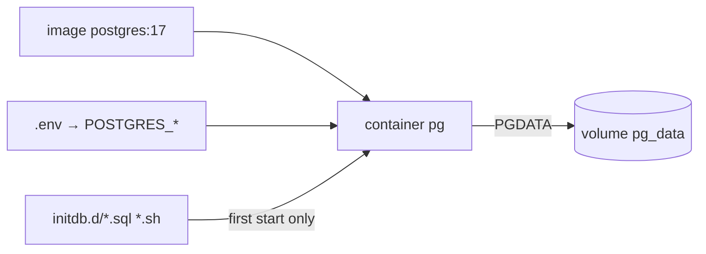

# Postgres in Docker — Image, Volumes, Env

> A container is disposable. A volume holds the durable data. Lose the volume = lose the database.



## Example — raw docker run

```bash
docker volume create pg_data
docker run -d --name pg \
  -e POSTGRES_USER=app -e POSTGRES_PASSWORD=secret -e POSTGRES_DB=shop \
  -v pg_data:/var/lib/postgresql/data \
  -p 127.0.0.1:5432:5432 \
  postgres:17

docker rm -f pg              # container gone
docker run ... (same command) # data still there ✅ (in the volume)
```

## Env vars

| Var | Meaning |
|---|---|
| `POSTGRES_PASSWORD` | **required** (superuser) |
| `POSTGRES_USER` | default `postgres` |
| `POSTGRES_DB` | default = user |
| `POSTGRES_INITDB_ARGS` | e.g. `--data-checksums` |
| `PGDATA` | data location inside the container |

## Image tags

| Tag | PGDATA |
|---|---|
| `postgres:17` | `/var/lib/postgresql/data` (Debian trixie based) |
| `postgres:18` | `/var/lib/postgresql/18/docker` (mount `/var/lib/postgresql`) |

## Key Points
- Pin the major: `postgres:17`, not `latest`
- Named volume > bind mount (permissions)
- Major upgrade = `pg_dump` / `pg_upgrade`, not a tag change

## Pitfall
❌ `image: postgres:latest` → the day it becomes 18, the container won't start on 17 data
✅ `image: postgres:17`

Next → [02-compose-healthcheck](02-compose-healthcheck.md)
