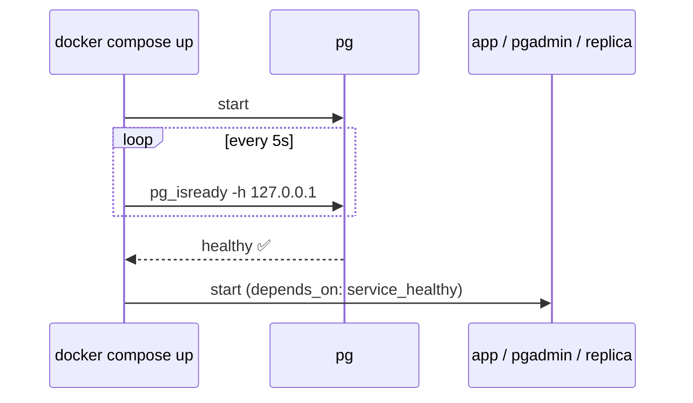

# Docker Compose — Config, Healthcheck, depends_on

> Compose = the whole stack in one file. A healthcheck makes other services wait until Postgres is really ready.



## Config — 3 ways

```yaml
# 1) command flags (simple — used in this repo)
command: >
  postgres -c shared_buffers=2GB -c max_connections=100

# 2) full file
command: postgres -c config_file=/etc/postgresql/postgresql.conf
volumes:
  - ./postgresql.conf:/etc/postgresql/postgresql.conf:ro

# 3) at runtime (saved in postgresql.auto.conf)
#    ALTER SYSTEM SET work_mem = '16MB'; SELECT pg_reload_conf();
```

## Healthcheck

```yaml
healthcheck:
  test: ["CMD-SHELL", "pg_isready -h 127.0.0.1 -U $${POSTGRES_USER} -d $${POSTGRES_DB}"]
  interval: 5s
  retries: 30
```

| Detail | Why |
|---|---|
| `-h 127.0.0.1` | during init the temp server listens on the socket only → not healthy too early (verified) |
| `$${VAR}` | `$$` escapes compose interpolation; the var is read inside the container |

## Useful commands

| | |
|---|---|
| `docker compose ps` | status + health |
| `docker compose logs -f pg` | logs |
| `docker compose exec pg psql -U app shop` | psql |
| `docker compose restart pg` | after a config change |
| `docker stats` | live CPU / RAM |

## Pitfall
❌ `ports: "5432:5432"` → open to the internet (Docker bypasses UFW)
✅ `"127.0.0.1:5432:5432"`

Next → [11-vps-deploy/01-vps-setup](../11-vps-deploy/01-vps-setup.md)
