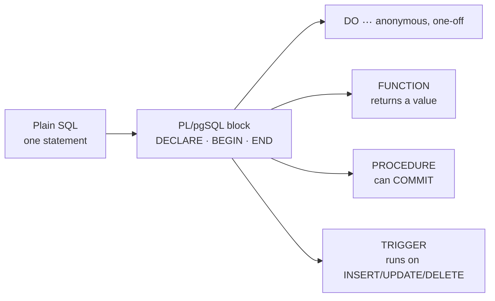

# PL/pgSQL Basics

> PostgreSQL's procedural language: SQL + variables, `IF`, loops, and error handling — running **inside** the server, next to the data.



## Block structure

```sql
DO $$                                  -- $$ = dollar quoting: no escaping of ' inside
DECLARE
    v_status  text := 'paid';          -- default value
    v_count   bigint;
    v_user    users%ROWTYPE;           -- a whole row of users
    v_price   products.price%TYPE;     -- same type as the column
BEGIN
    SELECT count(*) INTO v_count FROM orders WHERE status = v_status;
    SELECT * INTO v_user FROM users WHERE id = 42;
    SELECT price INTO v_price FROM products WHERE id = 1;

    RAISE NOTICE 'paid orders = %, user 42 = % (%), product 1 price = %',
                 v_count, v_user.email, v_user.country, v_price;
END $$;
-- NOTICE:  paid orders = 251530, user 42 = user42@shop.test (JO), product 1 price = 144.39
```

## IF / CASE

```sql
IF v_count > 300000 THEN
    RAISE NOTICE 'very busy';
ELSIF v_count > 200000 THEN
    RAISE NOTICE 'busy';                  -- ← printed (measured)
ELSE
    RAISE NOTICE 'quiet';
END IF;

CASE v_user.country
    WHEN 'JO', 'PS' THEN RAISE NOTICE 'Levant';   -- ← printed
    WHEN 'SA', 'AE' THEN RAISE NOTICE 'Gulf';
    ELSE RAISE NOTICE 'other';
END CASE;
```

## `INTO` vs `INTO STRICT` (measured)

| Query result | `INTO` | `INTO STRICT` |
|---|---|---|
| 0 rows | variable = `NULL`, silently | `ERROR: query returned no rows` |
| 1 row | ✅ | ✅ |
| many rows | takes the first, silently | `ERROR: query returned more than one row` |

Use `IF NOT FOUND THEN …` after a plain `INTO` to detect "no row".

## Types cheatsheet

| Declaration | Meaning |
|---|---|
| `v int := 0;` | scalar with default |
| `v users%ROWTYPE;` | full row of a table |
| `v orders.qty%TYPE;` | follows the column's type |
| `r record;` | any row shape (loops) |
| `c CONSTANT int := 10;` | read-only |

## Key Points
- `DO` = run once, returns nothing
- `%TYPE` survives column type changes
- `STRICT` when exactly one row is expected

## Pitfall
❌ Variable named like a column (`status`) → `ambiguous column reference`
✅ Prefix variables: `v_status`, parameters: `p_status`

Next → [02-loops](02-loops.md)
