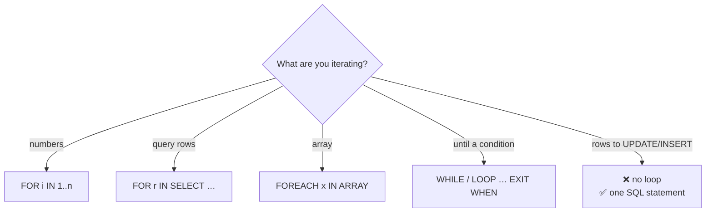

# Loops — and When Not to Use Them

> PL/pgSQL has every loop you expect. The most important lesson: a single set-based SQL statement almost always beats a loop.



## All loop forms (measured output)

```sql
DO $$
DECLARE i int; r record; total numeric := 0; tag text;
BEGIN
    FOR i IN 1..3 LOOP RAISE NOTICE 'i = %', i; END LOOP;            -- 1, 2, 3

    FOR r IN SELECT category, count(*) AS n FROM products GROUP BY 1 ORDER BY 1 LOOP
        RAISE NOTICE '% → %', r.category, r.n;                        -- books → 1000 …
    END LOOP;

    FOREACH tag IN ARRAY ARRAY['sale', 'new', 'hot'] LOOP
        CONTINUE WHEN tag = 'new';                                     -- skip
        RAISE NOTICE 'tag %', tag;                                     -- sale, hot
    END LOOP;

    i := 0;
    WHILE total < 1000 LOOP
        i := i + 1;
        SELECT total + price INTO total FROM products WHERE id = i;
    END LOOP;
    RAISE NOTICE 'needed % products to pass 1000 (total %)', i, total;  -- 5 (1013.37)

    LOOP
        i := i - 1;
        EXIT WHEN i <= 0;
    END LOOP;
END $$;
```

## Row-by-row vs set-based (measured)

Same result (`same_result = t`), 100,000 rows:

```sql
-- ❌ loop: 100K separate UPDATE statements
DO $$ DECLARE r record; BEGIN
    FOR r IN SELECT id FROM o_loop LOOP
        UPDATE o_loop SET qty = qty + 1 WHERE id = r.id;
    END LOOP;
END $$;
-- Time: 9221 ms

-- ✅ one statement
UPDATE o_set SET qty = qty + 1;
-- Time: 2934 ms
```

| Approach | Time | Relative |
|---|---|---|
| Loop, 1 UPDATE per row | 9.2 s | 3.1× slower |
| One set-based UPDATE | 2.9 s | 1× |

The gap grows with index count and network hops (an app loop adds a round-trip per row).

## When a loop is right

| ✅ Loop | ❌ Loop |
|---|---|
| Batching with `COMMIT` per chunk ([04](04-procedures.md)) | Updating each row the same way |
| Per-row external decision you can't express in SQL | Summing / counting (use aggregates) |
| Dynamic SQL per table ([06](06-dynamic-sql.md)) | Copying rows (use `INSERT … SELECT`) |

## Pitfall
❌ `FOR r IN SELECT * FROM big_table LOOP … INSERT … END LOOP`
✅ `INSERT INTO target SELECT … FROM big_table WHERE …`

Next → [03-functions](03-functions.md)
