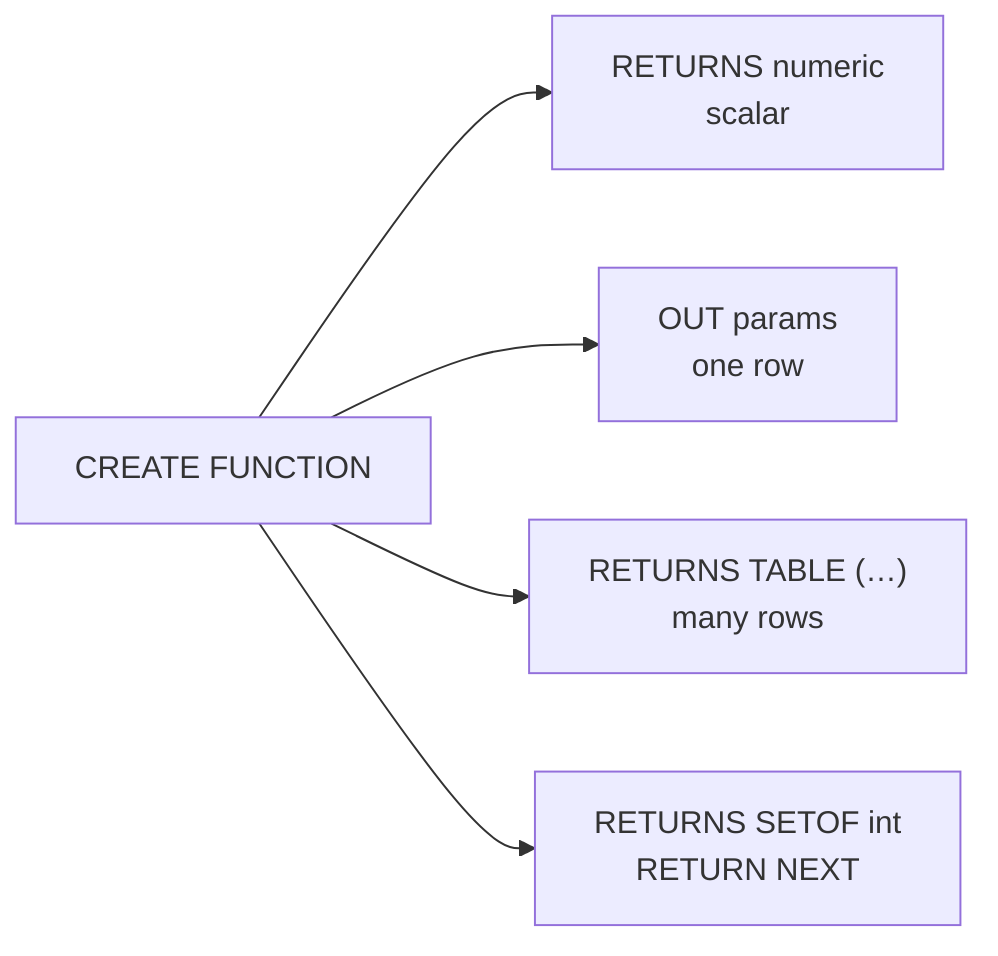

# Functions — Returning Values, Rows, and Tables

> A function takes parameters and returns a value, a row, or a set of rows. It runs inside the caller's transaction.



## RETURNS TABLE (measured)

```sql
CREATE OR REPLACE FUNCTION top_products(p_category text, p_limit int DEFAULT 3)
RETURNS TABLE (product_id bigint, name text, units bigint)
LANGUAGE plpgsql STABLE AS $$
BEGIN
    RETURN QUERY
    SELECT p.id, p.name, sum(o.qty)::bigint
    FROM products p JOIN orders o ON o.product_id = p.id
    WHERE p.category = p_category
    GROUP BY p.id, p.name
    ORDER BY 3 DESC
    LIMIT p_limit;
END $$;

SELECT * FROM top_products('books');                               -- default p_limit = 3
--  2585 | Product 2585 | 740
--  3010 | Product 3010 | 740
--  2975 | Product 2975 | 734
SELECT * FROM top_products(p_category => 'toys', p_limit => 2);   -- named notation
```

## OUT parameters — one row, several values

```sql
CREATE FUNCTION price_stats(p_category text,
    OUT min_price numeric, OUT max_price numeric, OUT avg_price numeric)
LANGUAGE sql STABLE AS $$
    SELECT min(price), max(price), round(avg(price), 2) FROM products WHERE category = p_category;
$$;
SELECT * FROM price_stats('electronics');     --  5.19 | 498.67 | 250.98
```

## SETOF + RETURN NEXT

```sql
CREATE FUNCTION even_numbers(p_max int) RETURNS SETOF int
LANGUAGE plpgsql IMMUTABLE AS $$
BEGIN
    FOR i IN 1..p_max LOOP
        IF i % 2 = 0 THEN RETURN NEXT i; END IF;
    END LOOP;
END $$;
SELECT array_agg(n) FROM even_numbers(10) n;  -- {2,4,6,8,10}
```

## SECURITY DEFINER — controlled access (measured)

```sql
CREATE FUNCTION user_order_count(p_user bigint) RETURNS bigint
LANGUAGE sql STABLE
SECURITY DEFINER                      -- runs with the OWNER's privileges
SET search_path = public, pg_temp     -- ⚠️ mandatory: blocks search_path hijacking
AS $$ SELECT count(*) FROM orders WHERE user_id = p_user; $$;

REVOKE ALL ON FUNCTION user_order_count(bigint) FROM PUBLIC;
GRANT EXECUTE ON FUNCTION user_order_count(bigint) TO demo_ro;

SET ROLE demo_ro;
SELECT user_order_count(42);      -- 12 ✅
SELECT count(*) FROM orders;      -- ERROR: permission denied for table orders ✅
```

## Choosing options

| Option | Use |
|---|---|
| `LANGUAGE sql` | single query → can be inlined by the planner (faster) |
| `LANGUAGE plpgsql` | variables, IF, loops, exceptions |
| `IMMUTABLE` / `STABLE` / `VOLATILE` | see [09-01](../09-ecosystem/01-functions-triggers.md); wrong label = wrong results or no index use |
| `STRICT` (function option) | returns NULL immediately if any argument is NULL |
| `PARALLEL SAFE` | allows parallel query plans |

## Pitfall
❌ `SECURITY DEFINER` without `SET search_path` → a user creates `public.count()` and runs code as the owner
✅ Always pin `search_path` and `REVOKE … FROM PUBLIC`

Next → [04-procedures](04-procedures.md)
