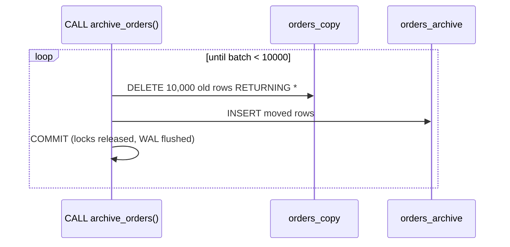

# Procedures — Transactions Inside

> A procedure (PG11+) is called with `CALL` and may `COMMIT` / `ROLLBACK` in the middle — perfect for batch jobs that must not hold one giant transaction.



## Function vs procedure

| | FUNCTION | PROCEDURE |
|---|---|---|
| Called with | `SELECT f()` | `CALL p()` |
| Returns | value / rows | nothing (or `INOUT` params) |
| `COMMIT` inside | ❌ | ✅ (when not in an outer transaction) |
| Usable in a query | ✅ | ❌ |

## Example — archive in batches (measured)

```sql
CREATE TABLE orders_archive (LIKE orders);

CREATE PROCEDURE archive_orders(p_before timestamptz, p_batch int DEFAULT 10000)
LANGUAGE plpgsql AS $$
DECLARE
    v_moved int;
    v_total int := 0;
BEGIN
    LOOP
        WITH moved AS (
            DELETE FROM orders_copy
            WHERE id IN (SELECT id FROM orders_copy WHERE created_at < p_before LIMIT p_batch)
            RETURNING *
        )
        INSERT INTO orders_archive SELECT * FROM moved;

        GET DIAGNOSTICS v_moved = ROW_COUNT;      -- rows affected by the last statement
        v_total := v_total + v_moved;
        COMMIT;                                    -- each batch is durable on its own
        RAISE NOTICE 'batch moved %, total %', v_moved, v_total;
        EXIT WHEN v_moved < p_batch;
    END LOOP;
END $$;

CALL archive_orders(now() - interval '300 days', 10000);
-- NOTICE:  batch moved 10000, total 10000
-- NOTICE:  batch moved 10000, total 20000
-- NOTICE:  batch moved 10000, total 30000
-- NOTICE:  batch moved 6057, total 36057
-- Time: 2290 ms   (200K-row copy of orders)
```

## Why batches?

| One big `DELETE` of 5M rows | Batched procedure |
|---|---|
| Locks rows for the whole run | Locks 10K rows at a time |
| Huge single WAL burst, replica lag spike | Steady WAL, replica keeps up |
| Crash at 99% → everything rolled back | Crash → only the current batch rolled back |
| VACUUM blocked until the end | Dead tuples reclaimable between batches |

## Pitfall (measured)
❌ Calling it inside an explicit transaction:
```sql
BEGIN;
CALL archive_orders(now() - interval '200 days');
-- ERROR:  invalid transaction termination
```
✅ Call it at top level (autocommit). ORMs often wrap everything in a transaction — call batch procedures from a plain connection or `psql`.

Next → [05-errors](05-errors.md)
