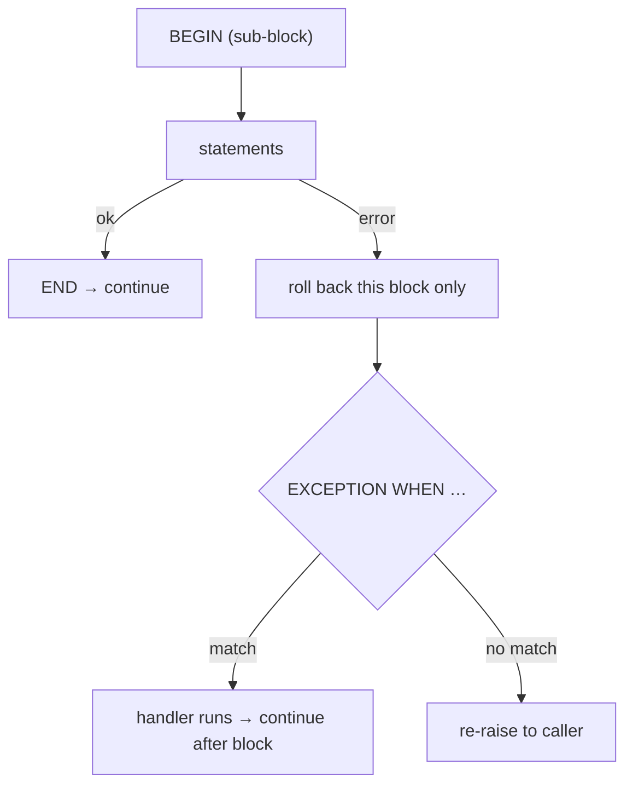

# Errors — RAISE and EXCEPTION

> `RAISE` reports or throws; `EXCEPTION WHEN` catches. Every `BEGIN … EXCEPTION` block is a **subtransaction** — useful, but not free.



## RAISE levels

| Level | Effect |
|---|---|
| `DEBUG` / `LOG` | server log only (by default) |
| `NOTICE` / `INFO` | message to the client |
| `WARNING` | message, execution continues |
| `EXCEPTION` | **aborts** the statement / transaction |

## Throw a meaningful error (measured)

```sql
CREATE FUNCTION place_order(p_user bigint, p_product bigint, p_qty int)
RETURNS bigint LANGUAGE plpgsql AS $$
DECLARE v_stock int; v_id bigint;
BEGIN
    SELECT stock INTO v_stock FROM products WHERE id = p_product FOR UPDATE;
    IF NOT FOUND THEN
        RAISE EXCEPTION 'product % not found', p_product USING ERRCODE = 'no_data_found';
    END IF;
    IF v_stock < p_qty THEN
        RAISE EXCEPTION 'insufficient stock for product %: have %, need %', p_product, v_stock, p_qty
              USING ERRCODE = 'P0001', HINT = 'reduce qty or restock';
    END IF;
    UPDATE products SET stock = stock - p_qty WHERE id = p_product;
    INSERT INTO orders (user_id, product_id, qty) VALUES (p_user, p_product, p_qty) RETURNING id INTO v_id;
    RETURN v_id;
END $$;

SELECT place_order(1, 1, 10000000);
-- ERROR:  insufficient stock for product 1: have 100000, need 10000000
-- HINT:  reduce qty or restock
```
The app can switch on `SQLSTATE` (`P0001`, `P0002`) instead of parsing text.

## Catch and inspect (measured)

```sql
DO $$
DECLARE v_state text; v_detail text; v_constraint text;
BEGIN
    BEGIN
        INSERT INTO users (email, name, country) VALUES ('user1@shop.test', 'dup', 'JO');
    EXCEPTION WHEN unique_violation THEN
        GET STACKED DIAGNOSTICS v_state = RETURNED_SQLSTATE,
                                v_detail = PG_EXCEPTION_DETAIL,
                                v_constraint = CONSTRAINT_NAME;
        RAISE NOTICE 'caught % on % → %', v_state, v_constraint, v_detail;
    END;
    BEGIN
        INSERT INTO orders (user_id, product_id, qty) VALUES (1, 1, -1);
    EXCEPTION
        WHEN check_violation THEN RAISE NOTICE 'check_violation: %', SQLERRM;
        WHEN OTHERS          THEN RAISE NOTICE 'other: % %', SQLSTATE, SQLERRM;
    END;
    RAISE NOTICE 'block continues after both errors';
END $$;
-- NOTICE:  caught 23505 on users_email_key → Key (email)=(user1@shop.test) already exists.
-- NOTICE:  check_violation: new row for relation "orders" violates check constraint "orders_qty_check"
-- NOTICE:  block continues after both errors
```

## Cost of an EXCEPTION block (measured, 200K iterations)

| Loop body | Time |
|---|---|
| `s := s + i;` | 83 ms |
| `BEGIN s := s + i; EXCEPTION WHEN OTHERS THEN NULL; END;` | 471 ms (5.7×) |

Each entry into a block with `EXCEPTION` starts a subtransaction, even when nothing fails.

## Pitfall
❌ `EXCEPTION WHEN OTHERS THEN NULL;` → errors silently swallowed, data half-written
✅ Catch **specific** conditions; log and `RAISE;` (re-throw) anything else

Next → [06-dynamic-sql](06-dynamic-sql.md)
