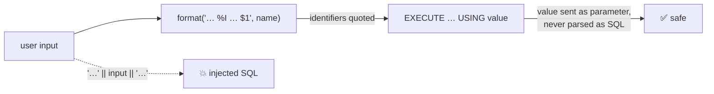

# Dynamic SQL — EXECUTE Safely

> When table or column names are only known at runtime, build the SQL with `format()` and pass values with `USING`. String concatenation = SQL injection.



## Safe version (measured)

```sql
CREATE FUNCTION count_where(p_table text, p_column text, p_value text)
RETURNS bigint LANGUAGE plpgsql STABLE AS $$
DECLARE v_n bigint;
BEGIN
    EXECUTE format('SELECT count(*) FROM %I WHERE %I = $1', p_table, p_column)
    INTO v_n
    USING p_value;
    RETURN v_n;
END $$;

SELECT count_where('orders', 'status', 'paid')               AS paid,               -- 251530
       count_where('users',  'country', 'JO')                AS jordan,             -- 16666
       count_where('users',  'email', $$x' OR '1'='1$$)      AS injection_attempt;  -- 0 ✅
```

## Unsafe version (measured)

```sql
-- ❌ concatenation
EXECUTE 'SELECT count(*) FROM ' || p_table || ' WHERE ' || p_column || ' = ''' || p_value || ''''
INTO v_n;

SELECT count_where_bad('users', 'email', $$x' OR '1'='1$$);
-- 100000   ← every user matched: the input became part of the SQL
```

## format() placeholders

| Placeholder | For | Example output |
|---|---|---|
| `%I` | identifier (table, column) | `"Order Items"` (quoted only when needed) |
| `%L` | literal value | `'O''Reilly'` |
| `%s` | raw text — **never** for user input | as-is |
| `$1`, `$2` + `USING` | values | sent separately ✅ best |

```sql
SELECT format('SELECT * FROM %I WHERE %I = %L', 'Order Items', 'name', $$O'Reilly$$);
-- SELECT * FROM "Order Items" WHERE name = 'O''Reilly'
```

## Typical uses

| Use | Example |
|---|---|
| Maintenance over many tables | `EXECUTE format('VACUUM ANALYZE %I', t)` in a loop |
| Create next month's partition | `EXECUTE format('CREATE TABLE %I PARTITION OF events …', name)` |
| Generic filters in admin tools | the function above |

## Key Points
- `%I` for names, `USING` for values
- Dynamic SQL is re-planned every call
- Check names against `information_schema` when they come from users

## Pitfall
❌ `EXECUTE '… WHERE email = ''' || p_email || ''''`
✅ `EXECUTE '… WHERE email = $1' USING p_email`

Next → [07-triggers-deep](07-triggers-deep.md)
