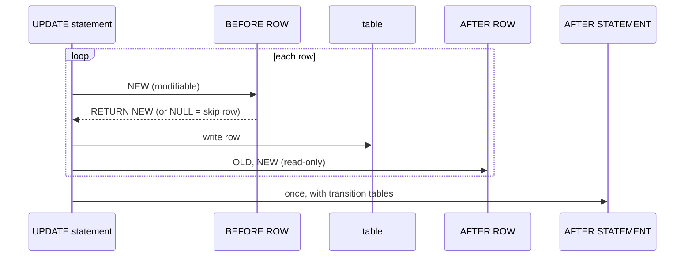

# Triggers in Depth

> `BEFORE` triggers can change or reject the row; `AFTER` triggers react to it. Row-level fires per row, statement-level once per statement.



## BEFORE — normalize + validate (measured)

```sql
CREATE FUNCTION trg_before_product() RETURNS trigger LANGUAGE plpgsql AS $$
BEGIN
    NEW.name       := initcap(trim(NEW.name));
    NEW.updated_at := now();
    IF NEW.price <= 0 THEN
        RAISE EXCEPTION 'price must be > 0 (got %)', NEW.price;
    END IF;
    RETURN NEW;          -- RETURN NULL would silently skip the row
END $$;

CREATE TRIGGER t_prod_before BEFORE INSERT OR UPDATE ON t_prod
FOR EACH ROW EXECUTE FUNCTION trg_before_product();

UPDATE t_prod SET name = '  super keyboard ' WHERE id = 1 RETURNING name;   -- Super Keyboard
UPDATE t_prod SET price = 0 WHERE id = 1;       -- ERROR: price must be > 0 (got 0.00)
```

## AFTER — one generic audit for any table (measured)

```sql
CREATE FUNCTION trg_audit() RETURNS trigger LANGUAGE plpgsql AS $$
BEGIN
    INSERT INTO audit_log (table_name, op, row_id, old_row, new_row)
    VALUES (TG_TABLE_NAME, TG_OP, COALESCE(NEW.id, OLD.id),
            CASE WHEN TG_OP <> 'INSERT' THEN to_jsonb(OLD) END,
            CASE WHEN TG_OP <> 'DELETE' THEN to_jsonb(NEW) END);
    RETURN NULL;         -- ignored for AFTER triggers
END $$;

CREATE TRIGGER t_prod_audit AFTER INSERT OR UPDATE OR DELETE ON t_prod
FOR EACH ROW EXECUTE FUNCTION trg_audit();

UPDATE t_prod SET price = 99 WHERE id = 2;
DELETE FROM t_prod WHERE id = 3;
SELECT op, row_id, old_row->>'price', new_row->>'price' FROM audit_log;
--  UPDATE | 2 | 384.81 | 99.00
--  DELETE | 3 | 11.93  |
```

## Trigger variables

| Variable | Value |
|---|---|
| `NEW` / `OLD` | the row after / before (NULL where not applicable) |
| `TG_OP` | `INSERT` · `UPDATE` · `DELETE` · `TRUNCATE` |
| `TG_TABLE_NAME` | table that fired it |
| `TG_WHEN` | `BEFORE` · `AFTER` · `INSTEAD OF` |
| `TG_ARGV[]` | arguments from `CREATE TRIGGER … (args)` |

## Statement-level with transition tables

```sql
CREATE TRIGGER t_prod_audit_stmt AFTER UPDATE ON t_prod
REFERENCING OLD TABLE AS old_rows NEW TABLE AS new_rows
FOR EACH STATEMENT EXECUTE FUNCTION trg_audit_stmt();
-- inside: INSERT INTO audit_log SELECT … FROM new_rows n JOIN old_rows o USING (id);
```

## Overhead (measured, UPDATE of 4,999 rows)

| Setup | Time | Relative |
|---|---|---|
| No trigger | 128 ms | 1× |
| Row-level audit trigger | 820 ms | 6.4× |
| Statement-level + transition tables | 452 ms | 3.5× |

## Key Points
- Modify data → `BEFORE`; react → `AFTER`
- Bulk writes → statement-level
- Add `WHEN (OLD.price IS DISTINCT FROM NEW.price)` to skip needless calls

## Pitfall
❌ Trigger on table A updates B, whose trigger updates A → recursion / deadlocks
✅ Keep triggers one-directional; check `pg_trigger_depth()` if unavoidable

Lab → [labs/10-plpgsql.sql](../../labs/10-plpgsql.sql)

Next → [11-docker/01-image-volumes](../11-docker/01-image-volumes.md)
