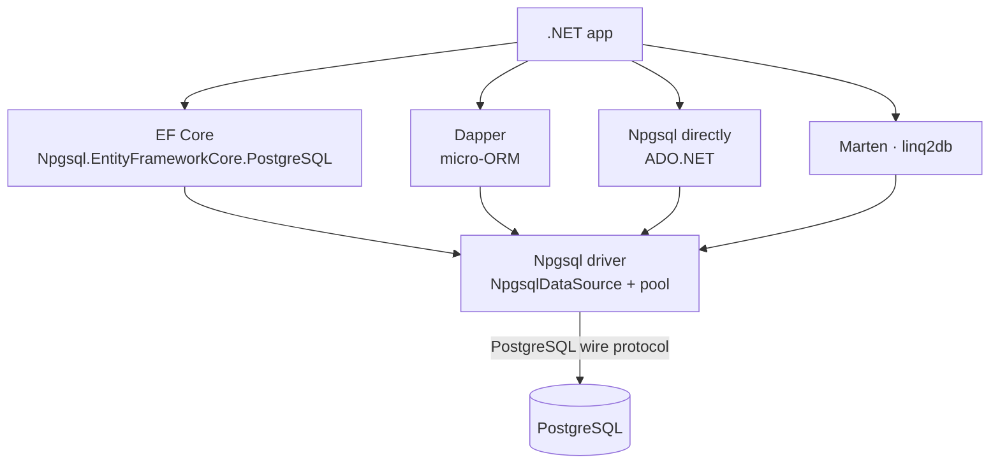

# .NET + PostgreSQL — Overview

> Every .NET option talks to PostgreSQL through **one driver: Npgsql**. Dapper and EF Core are layers on top of it — pick the layer, not the driver.



## Which one?

| | Npgsql (raw) | Dapper | EF Core |
|---|---|---|---|
| You write SQL | ✅ always | ✅ always | ❌ LINQ (raw SQL possible) |
| Maps rows → objects | ❌ by hand | ✅ | ✅ |
| Change tracking / migrations | ❌ | ❌ | ✅ |
| Postgres features (COPY, LISTEN) | ✅ full | via Npgsql | partial |
| Overhead | lowest | very low | higher (measure: [14](14-benchmark.md)) |
| Best for | bulk load, notifications, hot paths | read-heavy APIs, reports | CRUD domains, rich models |

A common, healthy mix: **EF Core for writes and domain logic, Dapper for heavy reads, raw Npgsql for COPY / LISTEN** — all sharing one `NpgsqlDataSource` ([04-WebApi](../../samples/dotnet/04-WebApi/Program.cs)).

## Others (short)

| Library | What it is |
|---|---|
| Marten | document DB + event store built on Postgres `jsonb` |
| linq2db | LINQ to SQL without change tracking (lighter than EF) |

## Packages used in this repo (resolved from NuGet, .NET 10)

| Package | Version |
|---|---|
| Npgsql | 10.0.3 |
| Npgsql.EntityFrameworkCore.PostgreSQL | 10.0.3 |
| Npgsql.DependencyInjection / Npgsql.OpenTelemetry | 10.0.3 |
| EFCore.NamingConventions | 10.0.1 |
| Dapper | 2.1.89 |
| Testcontainers.PostgreSql | 4.15.0 |
| BenchmarkDotNet | 0.15.8 |

## Samples — one project per approach, one layer each

```text
samples/dotnet/
├── 01-Npgsql/       raw ADO.NET: parameters, transactions, arrays, jsonb, COPY, LISTEN/NOTIFY
├── 02-Dapper/       QueryAsync, multi-mapping, jsonb handler, transactions
├── 03-EfCore/       DbContext, jsonb, xmin concurrency, ExecuteUpdate, compiled query
├── 04-WebApi/       Minimal API: DI, Dapper + EF on one pool, retries, health, OpenTelemetry
├── 05-Tests/        xUnit + Testcontainers + Respawn
├── 06-Benchmarks/   Npgsql vs Dapper vs EF Core
└── sql/             setup.sql (functions the samples call) · schema.sql (tests)
```

```bash
cd samples/dotnet
dotnet build                                   # all 6 projects (verified: 0 warnings, 0 errors)
dotnet run --project 01-Npgsql                 # needs the repo's Postgres running
```

Next → [02-connection](02-connection.md)
