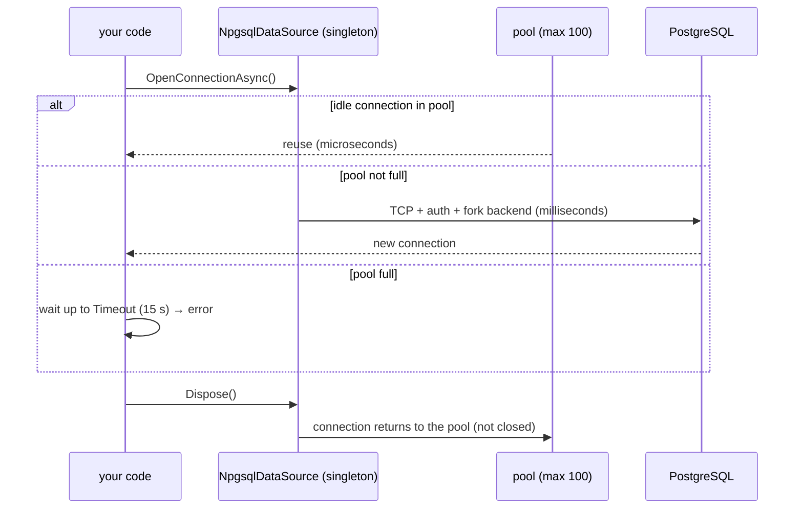

# Connecting — Connection String, NpgsqlDataSource, Pooling, DI

> Create **one `NpgsqlDataSource` per database per app**. It owns the connection pool; "opening" a connection just borrows one from the pool.



## Connection string

```text
Host=localhost;Port=5432;Database=shop;Username=app;Password=change_me_app;
Application Name=shop-api;Maximum Pool Size=50;Timeout=15;Command Timeout=30
```

| Keyword | Default | Meaning |
|---|---|---|
| `Maximum Pool Size` | 100 | connections this app may open |
| `Minimum Pool Size` | 0 | kept open even when idle |
| `Connection Idle Lifetime` | 300 s | idle connections closed after |
| `Timeout` | 15 s | wait for a free/new connection |
| `Command Timeout` | 30 s | per command (client side) |
| `Application Name` | — | shows in `pg_stat_activity` |
| `SSL Mode` | Prefer | `Require` / `VerifyFull` over the internet |
| `Options` | — | server settings, e.g. `-c statement_timeout=5000` |

Build it in code ([01-Npgsql](../../samples/dotnet/01-Npgsql/Program.cs)):

```csharp
var csb = new NpgsqlConnectionStringBuilder(connectionString)
{
    MaxPoolSize = 50,
    ConnectionIdleLifetime = 300,
    Timeout = 15,
    CommandTimeout = 30,
    ApplicationName = "shop-sample"
};
```

## Console app

```csharp
var builder = new NpgsqlDataSourceBuilder(connectionString);
builder.EnableDynamicJson();                       // optional: jsonb <-> POCO
await using var dataSource = builder.Build();

await using var cmd = dataSource.CreateCommand("SELECT count(*) FROM orders");
var count = (long)(await cmd.ExecuteScalarAsync())!;
```

## ASP.NET Core (DI)

```csharp
// package: Npgsql.DependencyInjection
builder.Services.AddNpgsqlDataSource(connectionString);           // singleton + logging wired

builder.Services.AddDbContext<ShopContext>((sp, options) => options
    .UseNpgsql(sp.GetRequiredService<NpgsqlDataSource>())        // EF shares the same pool
    .UseSnakeCaseNamingConvention());

app.MapGet("/products/{id:long}", async (long id, NpgsqlDataSource db) => { /* … */ });
```

## Pool math

```text
3 API instances × Maximum Pool Size 50 = 150 connections  >  max_connections 100  💥
3 API instances × 30 = 90  ✅   — or put PgBouncer in front ([10](10-pgbouncer.md))
```

## Pitfalls
❌ `new NpgsqlConnection(cs)` scattered everywhere with different strings → several pools
✅ One `NpgsqlDataSource`, injected

❌ Holding a connection for the whole request "just in case"
✅ `await using` it only around the commands that need it

Next → [03-npgsql-basics](03-npgsql-basics.md)
