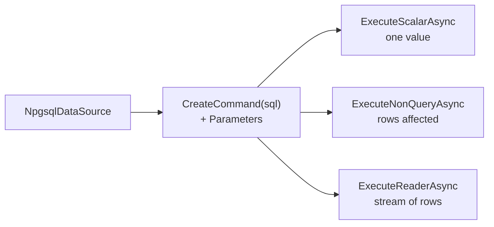

# Npgsql Basics — Commands, Parameters, Readers, Transactions

> Raw ADO.NET: you write SQL, bind parameters, read columns by position. Maximum control, minimum overhead.



## Scalar

```csharp
await using var cmd = dataSource.CreateCommand("SELECT count(*) FROM orders");
var count = (long)(await cmd.ExecuteScalarAsync())!;
```

## Parameters + reader

```csharp
// $1, $2 = positional parameters: the values are sent separately, never spliced into SQL
await using var cmd = dataSource.CreateCommand(
    "SELECT id, name, price FROM products WHERE category = $1 AND price < $2 ORDER BY price DESC LIMIT 5");
cmd.Parameters.Add(new NpgsqlParameter { Value = "electronics" });
cmd.Parameters.Add(new NpgsqlParameter { Value = 100m });

await using var reader = await cmd.ExecuteReaderAsync();
while (await reader.ReadAsync())
    Console.WriteLine($"{reader.GetInt64(0)} {reader.GetString(1)} {reader.GetDecimal(2)}");
```

## Type mapping

| PostgreSQL | .NET | Reader |
|---|---|---|
| `bigint` | `long` | `GetInt64` |
| `integer` | `int` | `GetInt32` |
| `numeric` | `decimal` | `GetDecimal` |
| `text` / `char(n)` | `string` | `GetString` |
| `boolean` | `bool` | `GetBoolean` |
| `timestamptz` | `DateTime` (Kind = **Utc**) | `GetDateTime` |
| `uuid` | `Guid` | `GetGuid` |
| `bigint[]` | `long[]` | `GetFieldValue<long[]>` |
| `jsonb` | `string` / POCO | `GetFieldValue<T>` ([04](04-npgsql-advanced.md)) |
| NULL | — | check `IsDBNull(i)` first |

## Transaction

```csharp
await using var conn = await dataSource.OpenConnectionAsync();
await using var tx = await conn.BeginTransactionAsync();

await using var decrement = new NpgsqlCommand(
    "UPDATE products SET stock = stock - 1 WHERE id = $1 AND stock > 0", conn, tx);
decrement.Parameters.Add(new NpgsqlParameter { Value = 1L });
if (await decrement.ExecuteNonQueryAsync() == 0)
    throw new InvalidOperationException("out of stock");

await using var insert = new NpgsqlCommand(
    "INSERT INTO orders (user_id, product_id, qty) VALUES ($1, $2, 1) RETURNING id", conn, tx);
insert.Parameters.Add(new NpgsqlParameter { Value = 42L });
insert.Parameters.Add(new NpgsqlParameter { Value = 1L });
var orderId = (long)(await insert.ExecuteScalarAsync())!;

await tx.CommitAsync();        // dispose without commit = rollback
```

Atomic `stock = stock - 1 … AND stock > 0` avoids the lost-update race ([06-02](../06-transactions-mvcc/02-isolation-levels.md)).

## Errors

```csharp
catch (PostgresException e) when (e.SqlState == PostgresErrorCodes.UniqueViolation)   // 23505
{
    return Results.Conflict($"duplicate: {e.ConstraintName}");
}
```

| Constant | SQLSTATE |
|---|---|
| `PostgresErrorCodes.UniqueViolation` | 23505 |
| `PostgresErrorCodes.ForeignKeyViolation` | 23503 |
| `PostgresErrorCodes.CheckViolation` | 23514 |
| `PostgresErrorCodes.SerializationFailure` | 40001 |
| `PostgresErrorCodes.DeadlockDetected` | 40P01 |

## Pitfalls
❌ `$"… WHERE email = '{email}'"` → SQL injection
✅ `$1` + `Parameters.Add(...)`

❌ `DateTime.Now` into `timestamptz` → `ArgumentException` (Kind must be Utc)
✅ `DateTime.UtcNow` or `DateTimeOffset`

Next → [04-npgsql-advanced](04-npgsql-advanced.md)
