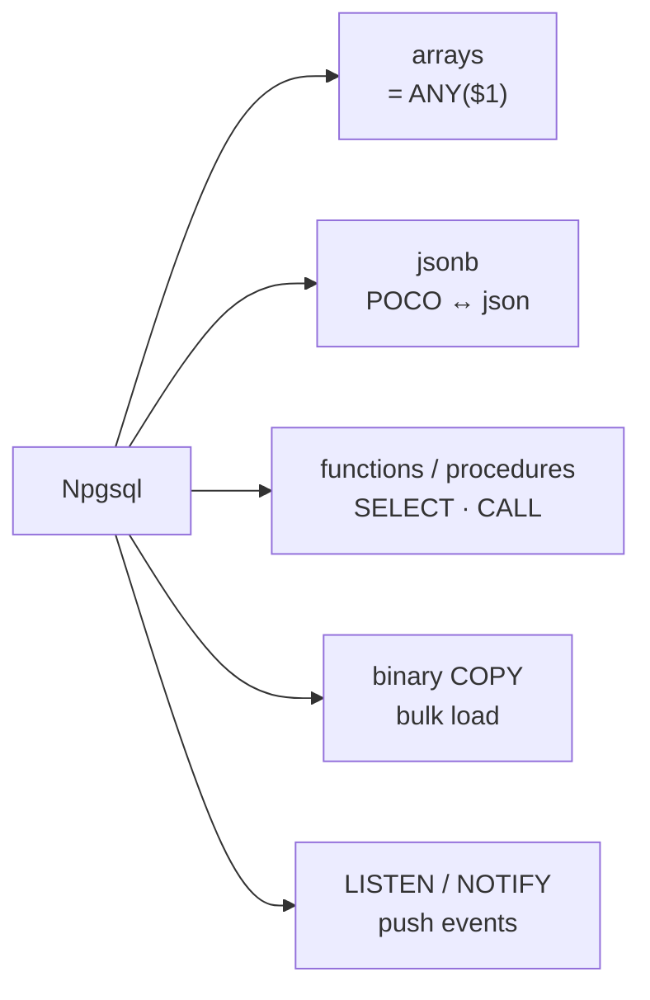
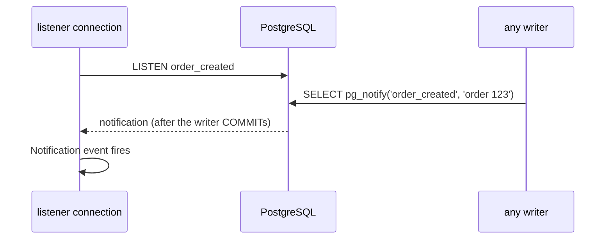

# Npgsql Advanced — Arrays, jsonb, Functions, COPY, LISTEN/NOTIFY

> The Postgres features that ORMs hide or don't support — reachable directly through Npgsql.



## Arrays

```csharp
await using var byIds = dataSource.CreateCommand("SELECT id, attrs FROM products WHERE id = ANY($1)");
byIds.Parameters.Add(new NpgsqlParameter { Value = new long[] { 1, 2, 3 } });   // long[] -> bigint[]
```
One parameter instead of `IN ($1, $2, $3, …)` → one cached plan for any list size.

## jsonb ↔ POCO

```csharp
var builder = new NpgsqlDataSourceBuilder(connectionString);
builder.ConfigureJsonOptions(new JsonSerializerOptions(JsonSerializerDefaults.Web)); // "color" ↔ Color
builder.EnableDynamicJson();
await using var dataSource = builder.Build();

var attrs = reader.GetFieldValue<ProductAttrs>(1);            // read jsonb as a record

await using var red = dataSource.CreateCommand("SELECT count(*) FROM products WHERE attrs @> $1");
red.Parameters.Add(new NpgsqlParameter { Value = new { color = "red" }, NpgsqlDbType = NpgsqlDbType.Jsonb });

record ProductAttrs(string Color, int Rating);
```

## Calling PL/pgSQL

```csharp
// function returning a table → a normal SELECT
await using var fn = dataSource.CreateCommand("SELECT product_id, name, units FROM top_products($1, $2)");
fn.Parameters.Add(new NpgsqlParameter { Value = "books" });
fn.Parameters.Add(new NpgsqlParameter { Value = 3 });

// procedure → CALL; INOUT parameters come back as a result row
await using var proc = dataSource.CreateCommand("CALL product_stock($1, NULL)");
proc.Parameters.Add(new NpgsqlParameter { Value = 1L });
var stock = await proc.ExecuteScalarAsync();
```
Both are created by [samples/dotnet/sql/setup.sql](../../samples/dotnet/sql/setup.sql). Background: [10-plpgsql](../10-plpgsql/03-functions.md).

## Binary COPY — bulk load

```csharp
await using var writer = await conn.BeginBinaryImportAsync(
    "COPY import_events (user_id, type, created_at) FROM STDIN (FORMAT BINARY)");
for (var i = 0; i < 100_000; i++)
{
    await writer.StartRowAsync();
    await writer.WriteAsync((long)(i % 1000), NpgsqlDbType.Bigint);
    await writer.WriteAsync("click", NpgsqlDbType.Text);
    await writer.WriteAsync(DateTime.UtcNow, NpgsqlDbType.TimestampTz);
}
await writer.CompleteAsync();              // without this, everything is rolled back
```

| Method for 10K rows (illustrative, see [02-sql-basics/02](../02-sql-basics/02-crud.md)) | |
|---|---|
| 10K separate INSERTs | ~3 s |
| one multi-row INSERT | ~60 ms |
| COPY | ~25 ms |

## LISTEN / NOTIFY — the database pushes events



```csharp
await using var listener = await dataSource.OpenConnectionAsync();       // dedicated connection
listener.Notification += (_, e) => Console.WriteLine($"received '{e.Payload}' on '{e.Channel}'");
await using (var listen = new NpgsqlCommand("LISTEN order_created", listener))
    await listen.ExecuteNonQueryAsync();

await listener.WaitAsync(cancellationToken);                              // blocks until a notification
```

| Good for | Not for |
|---|---|
| cache invalidation, "new order" pings | guaranteed delivery (lost if nobody listens) |
| payload < 8 KB | large messages → send an id, read the row |

## Pitfall
❌ LISTEN through PgBouncer in transaction mode → notifications never arrive
✅ Direct connection for listeners ([10](10-pgbouncer.md))

Code: [samples/dotnet/01-Npgsql](../../samples/dotnet/01-Npgsql/Program.cs)

Next → [05-dapper](05-dapper.md)
