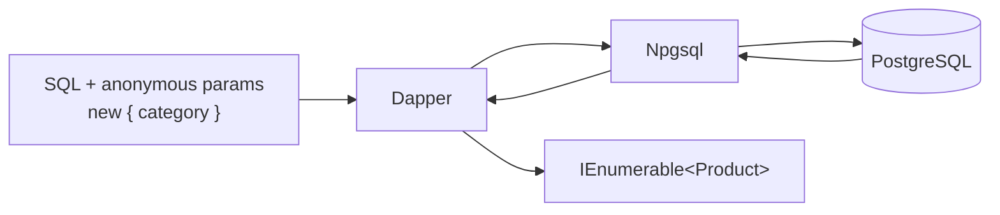

# Dapper

> You write the SQL, Dapper maps each row to an object. Near-raw speed, far less code than a `DataReader` loop.



## Setup

```csharp
DefaultTypeMap.MatchNamesWithUnderscores = true;            // created_at -> CreatedAt
SqlMapper.AddTypeHandler(new JsonbHandler<ProductAttrs>()); // jsonb <-> ProductAttrs

await using var dataSource = NpgsqlDataSource.Create(connectionString);
await using var conn = await dataSource.OpenConnectionAsync();
```

## Queries

```csharp
// many rows
var books = await conn.QueryAsync<Product>(
    "SELECT id, name, category, price, stock, attrs FROM products WHERE category = @category ORDER BY price DESC LIMIT 5",
    new { category = "books" });

// one row / one value
var user = await conn.QuerySingleOrDefaultAsync<User>(
    "SELECT id, email, name, country, created_at FROM users WHERE id = @id", new { id = 42L });
var orderCount = await conn.ExecuteScalarAsync<long>(
    "SELECT count(*) FROM orders WHERE user_id = @userId", new { userId = 42L });

// arrays: = ANY(@ids)
var some = await conn.QueryAsync<Product>(
    "SELECT id, name, category, price, stock, attrs FROM products WHERE id = ANY(@ids)",
    new { ids = new long[] { 1, 2, 3 } });
```

## Multi-mapping — one row, two objects

```csharp
var orders = await conn.QueryAsync<Order, Product, Order>(
    """
    SELECT o.id, o.user_id, o.qty, o.status, o.created_at,
           p.id, p.name, p.category, p.price, p.stock, p.attrs
    FROM orders o JOIN products p ON p.id = o.product_id
    WHERE o.user_id = @userId
    ORDER BY o.created_at DESC
    LIMIT 5
    """,
    (order, product) => { order.Product = product; return order; },
    new { userId = 42L },
    splitOn: "id");                          // the second "id" starts the Product columns
```

## jsonb type handler

```csharp
public sealed class JsonbHandler<T> : SqlMapper.TypeHandler<T>
{
    private static readonly JsonSerializerOptions Options = new(JsonSerializerDefaults.Web);

    public override T? Parse(object value) => JsonSerializer.Deserialize<T>((string)value, Options);

    public override void SetValue(IDbDataParameter parameter, T? value)
    {
        parameter.Value = JsonSerializer.Serialize(value, Options);
        ((NpgsqlParameter)parameter).NpgsqlDbType = NpgsqlDbType.Jsonb;
    }
}
```

## Functions + transactions

```csharp
var top = await conn.QueryAsync<TopProduct>(
    "SELECT product_id, name, units FROM top_products(@category, @limit)", new { category = "toys", limit = 3 });

await using var tx = await conn.BeginTransactionAsync();
await conn.ExecuteAsync("UPDATE products SET stock = stock - 1 WHERE id = @id AND stock > 0", new { id = 1L }, tx);
var newId = await conn.ExecuteScalarAsync<long>(
    "INSERT INTO orders (user_id, product_id, qty) VALUES (@userId, @productId, 1) RETURNING id",
    new { userId = 42L, productId = 1L }, tx);
await tx.CommitAsync();
```

## Key Points
- `@name` parameters → still sent as real parameters
- Pass the transaction (`tx`) to every call
- `AsList()` avoids a second enumeration

## Pitfalls
❌ `WHERE id IN @ids` → one parameter per element, new plan per list length
✅ `WHERE id = ANY(@ids)`

❌ `SELECT *` + class with fewer properties → wasted columns, silent mismatches on renames
✅ List the columns

Code: [samples/dotnet/02-Dapper](../../samples/dotnet/02-Dapper/Program.cs)

Next → [06-efcore-basics](06-efcore-basics.md)
