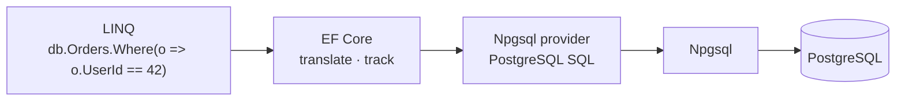

# EF Core Basics — DbContext on an Existing Schema

> EF Core translates LINQ to SQL, tracks changes, and generates migrations. The Npgsql provider teaches it PostgreSQL.



## DbContext mapped to `shop.sql`

```csharp
public sealed class ShopContext(DbContextOptions<ShopContext> options) : DbContext(options)
{
    public DbSet<User> Users => Set<User>();
    public DbSet<Product> Products => Set<Product>();
    public DbSet<Order> Orders => Set<Order>();

    protected override void OnModelCreating(ModelBuilder model)
    {
        model.Entity<User>().Property(u => u.Country).HasColumnType("char(2)");
        model.Entity<Product>(p =>
        {
            p.Property(x => x.Price).HasPrecision(10, 2);
            p.Property(x => x.Version).IsRowVersion();           // xmin
            p.OwnsOne(x => x.Attrs, a =>
            {
                a.ToJson();                                        // jsonb column "attrs"
                a.Property(x => x.Color).HasJsonPropertyName("color");
                a.Property(x => x.Rating).HasJsonPropertyName("rating");
            });
        });
        model.Entity<Order>(o =>
        {
            o.HasOne(x => x.User).WithMany(u => u.Orders).HasForeignKey(x => x.UserId)
             .OnDelete(DeleteBehavior.Restrict);                  // EF default would be CASCADE
            o.HasOne(x => x.Product).WithMany().HasForeignKey(x => x.ProductId)
             .OnDelete(DeleteBehavior.Restrict);
        });
    }
}
```

## Options

```csharp
var options = new DbContextOptionsBuilder<ShopContext>()
    .UseNpgsql(connectionString, npgsql => npgsql.EnableRetryOnFailure(maxRetryCount: 3))
    .UseSnakeCaseNamingConvention()                 // package EFCore.NamingConventions
    .LogTo(Console.WriteLine, LogLevel.Information) // print SQL
    .Options;
```

`UseSnakeCaseNamingConvention()` is what makes `Products` → `products` and `CreatedAt` → `created_at`.

## Check the mapping without a database (verified)

```bash
dotnet run --project samples/dotnet/03-EfCore -- --sql-only
```
```sql
CREATE TABLE orders (
    id bigint GENERATED BY DEFAULT AS IDENTITY,
    user_id bigint NOT NULL,
    product_id bigint NOT NULL,
    qty integer NOT NULL,
    status text NOT NULL,
    created_at timestamp with time zone NOT NULL,
    CONSTRAINT pk_orders PRIMARY KEY (id),
    CONSTRAINT fk_orders_users_user_id FOREIGN KEY (user_id) REFERENCES users (id) ...
);
```
Column names and types match `datasets/shop.sql` → the model is correct. (Before adding `OnDelete(Restrict)` this output showed `ON DELETE CASCADE` — a mismatch with the real database.)

## Basic operations

```csharp
// read (no tracking = faster, read-only)
var recent = await db.Orders.AsNoTracking()
    .Where(o => o.UserId == 42)
    .OrderByDescending(o => o.CreatedAt)
    .Select(o => new { o.Id, o.Qty, Product = o.Product!.Name })
    .Take(5)
    .ToListAsync();

// write (tracked)
var product = await db.Products.SingleAsync(p => p.Id == 1);
product.Stock += 10;
await db.SaveChangesAsync();          // UPDATE products SET stock = @p0 WHERE id = @p1 AND xmin = @p2
```

## Key Points
- One `DbContext` per unit of work (per request)
- `AsNoTracking()` for reads
- `ToQueryString()` shows the SQL

Code: [samples/dotnet/03-EfCore](../../samples/dotnet/03-EfCore/)

Next → [07-efcore-postgres-features](07-efcore-postgres-features.md)
