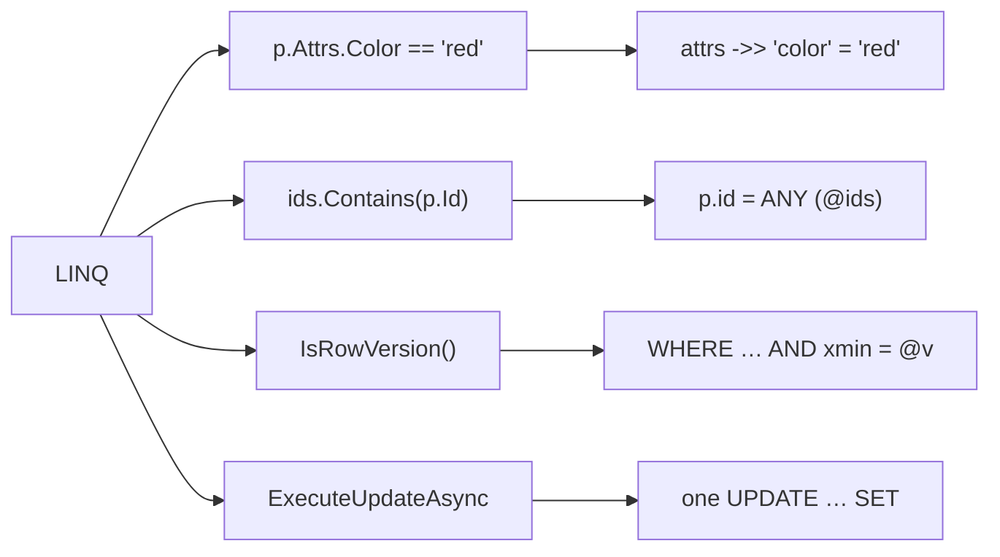
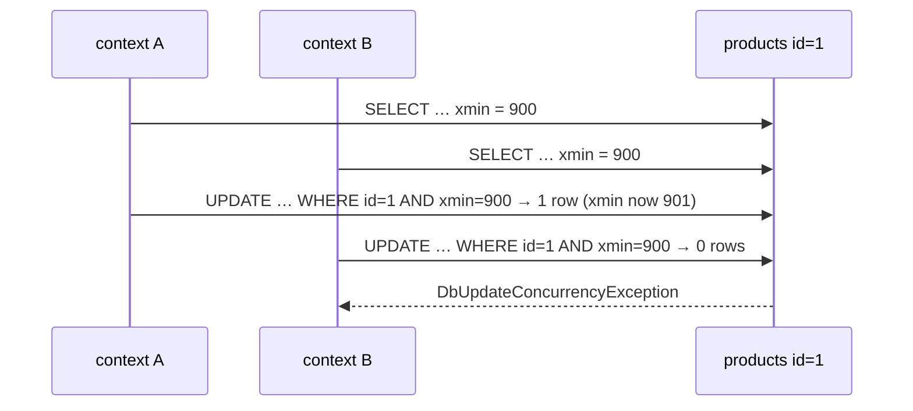

# EF Core — PostgreSQL Features

> The Npgsql provider maps Postgres-only features to LINQ: jsonb, arrays, `xmin` concurrency, bulk updates, raw SQL and functions.



All SQL below is the real `ToQueryString()` output from `03-EfCore -- --sql-only`.

## jsonb (owned type + `ToJson`)

```csharp
var red = await db.Products.CountAsync(p => p.Attrs.Color == "red");
```
```sql
SELECT p.id, p.category, p.name, p.price, p.stock, p.xmin, p.attrs
FROM products AS p
WHERE (p.attrs ->> 'color') = 'red'
```
⚠️ `->>` can't use a GIN index. For big tables add an expression index: `CREATE INDEX ON products ((attrs ->> 'color'));` ([05-04](../05-indexes-performance/04-partial-covering.md)).

## Arrays

```csharp
long[] ids = [1, 2, 3];
var names = await db.Products.Where(p => ids.Contains(p.Id)).Select(p => p.Name).ToListAsync();
```
```sql
-- @dryIds={ '1', '2', '3' } (DbType = Object)
SELECT p.name FROM products AS p WHERE p.id = ANY (@dryIds)
```

## Optimistic concurrency with `xmin`



```csharp
public uint Version { get; set; }                        // entity
p.Property(x => x.Version).IsRowVersion();               // mapping → system column xmin, no migration needed

try { await second.SaveChangesAsync(); }
catch (DbUpdateConcurrencyException) { /* reload, merge or tell the user */ }
```

## Bulk update / delete — no entities loaded

```csharp
var affected = await db.Products
    .Where(p => p.Category == "toys")
    .ExecuteUpdateAsync(s => s.SetProperty(p => p.Stock, p => p.Stock + 1));   // one UPDATE statement

await db.Orders.Where(o => o.Status == "cancelled").ExecuteDeleteAsync();
```
Bypasses change tracking and `SaveChanges` — no concurrency check, no events.

## Raw SQL and PL/pgSQL functions

```csharp
var category = "books";
var top = await db.Database
    .SqlQuery<TopProduct>($"SELECT product_id, name, units FROM top_products({category}, 3)")
    .ToListAsync();                           // {category} becomes a parameter, not string concat

var cheap = await db.Products
    .FromSql($"SELECT *, xmin FROM products WHERE price < {10m}")   // * skips system columns
    .AsNoTracking()
    .ToListAsync();
```
⚠️ `SELECT *` does not return `xmin`; an entity mapped with `IsRowVersion()` then fails with "required column 'xmin' was not present". Select it explicitly.

| Method | Safe? |
|---|---|
| `FromSql($"…{x}")` / `SqlQuery($"…{x}")` | ✅ parameterized |
| `FromSqlRaw("…" + x)` | ❌ injection |

## Key Points
- `xmin` = free concurrency token
- `ExecuteUpdate/Delete` for set-based writes
- Check translations with `ToQueryString()`

Next → [08-efcore-performance](08-efcore-performance.md)
