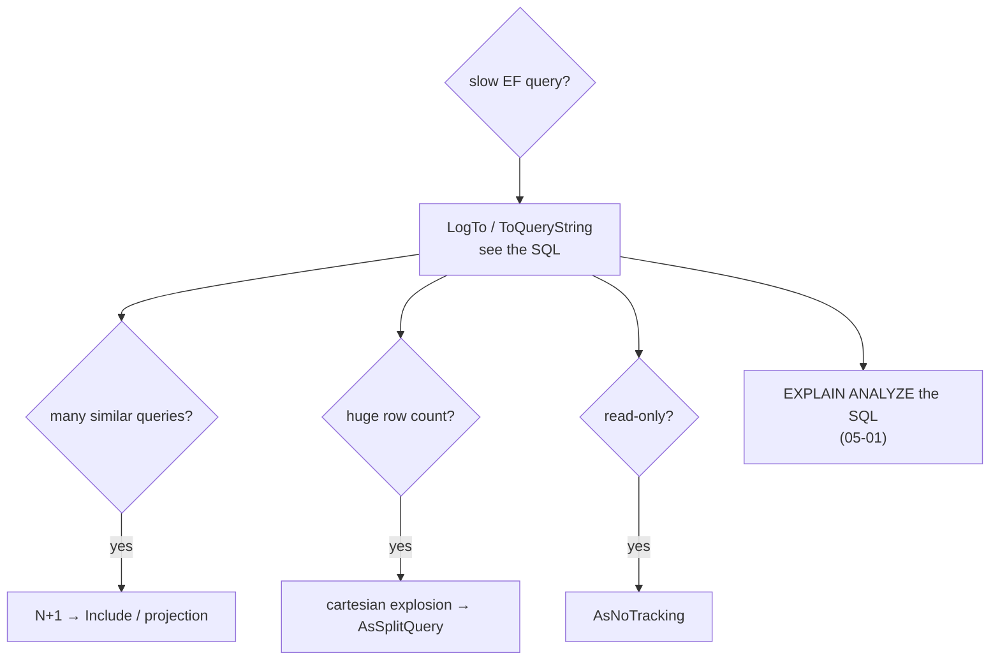

# EF Core Performance

> EF Core is fast when it generates the SQL you would have written. Most slowness comes from a handful of patterns.



## 1. N+1

```csharp
// ❌ 1 query for users + 1 per user (lazy loading or a loop)
foreach (var u in await db.Users.Where(u => u.Country == "JO").Take(100).ToListAsync())
    Console.WriteLine(await db.Orders.CountAsync(o => o.UserId == u.Id));   // 101 round-trips

// ✅ one query
var counts = await db.Users.Where(u => u.Country == "JO").Take(100)
    .Select(u => new { u.Id, Orders = u.Orders.Count() })
    .ToListAsync();
```

## 2. Projection instead of whole entities

```csharp
// generated SQL (real ToQueryString) — only 3 columns, LIMIT pushed into a subquery
SELECT o0.id AS "Id", o0.qty AS "Qty", p.name AS "Product"
FROM (
    SELECT o.id, o.created_at, o.product_id, o.qty
    FROM orders AS o
    WHERE o.user_id = 42
    ORDER BY o.created_at DESC
    LIMIT @p
) AS o0
INNER JOIN products AS p ON o0.product_id = p.id
ORDER BY o0.created_at DESC
```

## 3. Cartesian explosion → split query

```csharp
// one user with 12 orders and 3 other collections → rows multiply in one JOIN
var query = db.Users.Where(u => u.Country == "JO").Include(u => u.Orders).AsSplitQuery();
```
`AsSplitQuery()` runs one SQL per collection instead of one giant JOIN. Trade-off: more round-trips, and no single snapshot unless you wrap it in a transaction.

## 4. Tracking vs no tracking

| Call | Tracking cost |
|---|---|
| `db.Orders.ToListAsync()` | snapshot of every entity kept for change detection |
| `db.Orders.AsNoTracking().ToListAsync()` | none — use for all reads |

## 5. Compiled queries

```csharp
private static readonly Func<ShopContext, long, IAsyncEnumerable<Order>> OrdersOfUser =
    EF.CompileAsyncQuery((ShopContext db, long userId) =>
        db.Orders.AsNoTracking().Where(o => o.UserId == userId).OrderByDescending(o => o.CreatedAt).Take(5));

await foreach (var o in OrdersOfUser(db, 42)) { /* … */ }
```
Skips LINQ→SQL translation on every call; worth it on hot paths only.

## 6. Pooling contexts

```csharp
builder.Services.AddDbContextPool<ShopContext>(o => o.UseNpgsql(dataSource).UseSnakeCaseNamingConvention());
```
Reuses `DbContext` instances (not connections — those are pooled by Npgsql already).

## Numbers
Run the comparison yourself: [14-benchmark](14-benchmark.md) (Npgsql vs Dapper vs EF no-tracking / tracking / compiled).

## Pitfall
❌ `.ToList()` then `.Where()` in memory → loads the whole table
✅ Keep filters before `ToListAsync()` so they become SQL

Next → [09-resilience](09-resilience.md)
