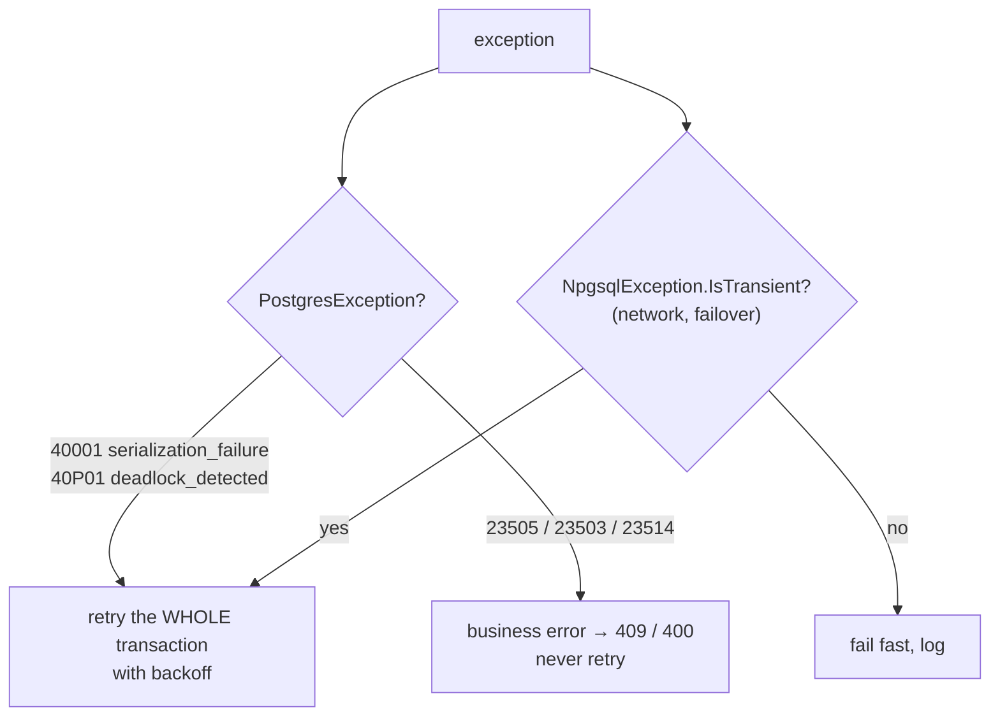

# Resilience — Retries, Timeouts, Transient Errors

> Networks drop, failovers happen, serializable transactions conflict. Retry what is safe to retry, time out everything else.



## EF Core — built-in retry

```csharp
options.UseNpgsql(dataSource, npgsql => npgsql.EnableRetryOnFailure(maxRetryCount: 3));
```

⚠️ With retries on, a manual transaction must run inside the execution strategy — otherwise EF throws `InvalidOperationException` ("the configured execution strategy does not support user-initiated transactions"):

```csharp
var strategy = db.Database.CreateExecutionStrategy();
await strategy.ExecuteAsync(async () =>
{
    await using var tx = await db.Database.BeginTransactionAsync();
    await db.Products.Where(p => p.Category == "toys")
        .ExecuteUpdateAsync(s => s.SetProperty(p => p.Stock, p => p.Stock + 1));
    await tx.CommitAsync();                  // the whole lambda is re-run on a transient failure
});
```
(This bug existed in the first draft of [03-EfCore](../../samples/dotnet/03-EfCore/Program.cs) and was caught in review.)

## Npgsql / Dapper — retry by hand

From [04-WebApi](../../samples/dotnet/04-WebApi/Program.cs):

```csharp
for (var attempt = 1; ; attempt++)
{
    try
    {
        await using var conn = await db.OpenConnectionAsync();
        await using var tx = await conn.BeginTransactionAsync();
        // … UPDATE stock, INSERT order …
        await tx.CommitAsync();
        return Results.Created($"/orders/{orderId}", new { orderId });
    }
    catch (PostgresException e) when (attempt < 3 && e.SqlState is
        PostgresErrorCodes.SerializationFailure or PostgresErrorCodes.DeadlockDetected)
    {
        await Task.Delay(50 * attempt);      // back off, then retry the whole transaction
    }
    catch (PostgresException e) when (e.SqlState == PostgresErrorCodes.ForeignKeyViolation)
    {
        return Results.BadRequest(new { error = "unknown user or product" });
    }
}
```

## Timeouts — three layers

| Layer | Setting | Protects against |
|---|---|---|
| Getting a connection | `Timeout=15` | pool exhausted |
| Client waits for a command | `Command Timeout=30` / `CancellationToken` | slow query holding a request |
| Server kills the statement | `Options=-c statement_timeout=5000` or `ALTER ROLE … SET statement_timeout` | runaway query keeps running after the client gave up |
| Server kills idle transactions | `idle_in_transaction_session_timeout` | forgotten open transaction ([06-03](../06-transactions-mvcc/03-mvcc.md)) |

```csharp
app.MapGet("/report", async (NpgsqlDataSource db, CancellationToken ct) =>
{
    await using var cmd = db.CreateCommand("SELECT … heavy …");
    return await cmd.ExecuteScalarAsync(ct);    // client disconnects → query is cancelled on the server
});
```

## What to retry

| Retry ✅ | Don't retry ❌ |
|---|---|
| 40001, 40P01 | 23xxx constraint violations |
| connection refused / reset during failover | 42xxx syntax / missing object |
| `57P01` admin shutdown | timeouts on non-idempotent writes without a key |

## Pitfall
❌ Retrying only the failed statement inside a transaction → the transaction is already aborted
✅ Retry the **entire** transaction from `BEGIN`

Next → [10-pgbouncer](10-pgbouncer.md)
