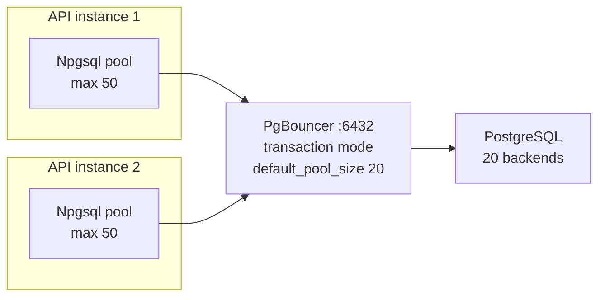

# Npgsql Behind PgBouncer

> Npgsql already pools connections inside **one** process. PgBouncer pools across **all** processes and servers. In transaction mode, a server connection belongs to you only for the duration of a transaction.



## Connection string for PgBouncer (transaction mode)

```text
Host=pgbouncer;Port=6432;Database=shop;Username=app;Password=…;
No Reset On Close=true;Maximum Pool Size=50
```

| Setting | Why |
|---|---|
| `Port=6432` | talk to PgBouncer, not Postgres |
| `No Reset On Close=true` | skip `DISCARD ALL` on return — PgBouncer resets server connections itself |
| prepared statements | PgBouncer ≥ 1.21 with `max_prepared_statements > 0` supports them; older versions → don't call `cmd.Prepare()` |

## What breaks in transaction mode

| Feature | Why it breaks | Do instead |
|---|---|---|
| `LISTEN` | the next statement may run on another server connection | direct connection for listeners |
| session `SET …` | lost after COMMIT | `SET LOCAL` inside the transaction, or role defaults |
| temp tables across transactions | gone / on another backend | keep them inside one transaction |
| advisory locks (session level) | released on another backend | `pg_advisory_xact_lock` |
| binary `COPY` | works (single statement) | ✅ |

## Two connection strings

```json
"ConnectionStrings": {
  "Shop":       "Host=pgbouncer;Port=6432;Database=shop;…;No Reset On Close=true",
  "ShopDirect": "Host=postgres;Port=5432;Database=shop;…"
}
```
`Shop` for requests, `ShopDirect` for migrations, LISTEN/NOTIFY, and long admin jobs.

## Pool math

```text
PgBouncer:  max_client_conn ≥ instances × Maximum Pool Size = 2 × 50 = 100
Postgres:   default_pool_size 20 ≤ max_connections 100
```

Background: [08-ops-scaling/04-pgbouncer](../08-ops-scaling/04-pgbouncer.md)

Next → [11-observability](11-observability.md)
