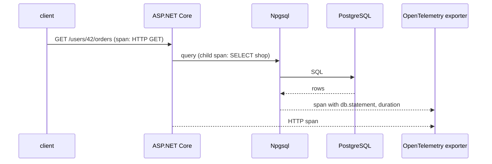

# Observability — Health Checks, Tracing, Logging

> See every SQL command inside a request trace, know when the database is down, and correlate app logs with `pg_stat_activity`.



## Wiring (from [04-WebApi](../../samples/dotnet/04-WebApi/Program.cs))

```csharp
builder.Services.AddNpgsqlDataSource(connectionString);          // logs through ILogger automatically

builder.Services.AddHealthChecks().AddNpgSql(connectionString);  // package AspNetCore.HealthChecks.NpgSql

builder.Services.AddOpenTelemetry().WithTracing(tracing => tracing
    .AddAspNetCoreInstrumentation()
    .AddNpgsql()                                                   // package Npgsql.OpenTelemetry
    .AddConsoleExporter());                                        // swap for OTLP → Jaeger / Grafana Tempo

app.MapHealthChecks("/health");
```

## What you get

| Signal | Where | Example |
|---|---|---|
| Health | `GET /health` | `Healthy` / `Unhealthy` (runs `SELECT 1`) |
| Traces | exporter | one span per SQL command, child of the HTTP span |
| Metrics | meter `Npgsql` → `metrics.AddMeter("Npgsql")` | pool size, busy connections, commands/s |
| Logs | `ILogger` category `Npgsql` | connection errors, slow statements |
| Server side | `pg_stat_activity.application_name` | `shop-api` (from `Application Name=`) |

## Correlate app ↔ database

```sql
SELECT pid, application_name, state, now() - query_start AS running, left(query, 60)
FROM pg_stat_activity
WHERE application_name = 'shop-api';
```

```sql
-- the slowest statements the app sends (Doc/09-ecosystem/03)
SELECT calls, round(mean_exec_time::numeric, 2) AS avg_ms, left(query, 70)
FROM pg_stat_statements ORDER BY total_exec_time DESC LIMIT 5;
```

## Dev-only switches

| Switch | Effect | Production? |
|---|---|---|
| `Include Error Detail=true` | error messages include row values | ❌ may leak data |
| EF `EnableSensitiveDataLogging()` | logs parameter values | ❌ |
| `dataSourceBuilder.EnableParameterLogging()` | same for Npgsql | ❌ |

## Pitfall
❌ Health check that only checks the app → load balancer keeps sending traffic while the DB is down
✅ Include the database check — and make it cheap (`SELECT 1`, short timeout)

Next → [12-testing](12-testing.md)
