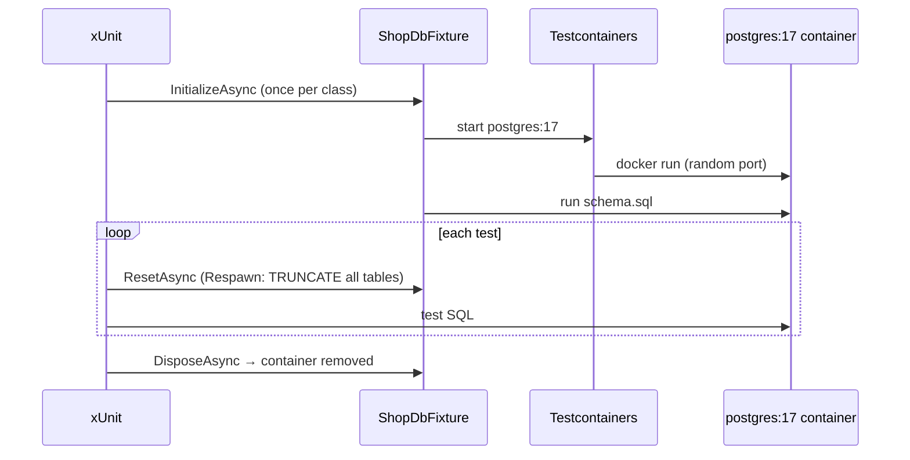

# Testing Against a Real PostgreSQL

> Mocks and in-memory providers don't enforce `CHECK`, `UNIQUE`, FKs, locks, or SQL dialect. Test against real Postgres in a throwaway container.



## Fixture (from [05-Tests](../../samples/dotnet/05-Tests/ShopDbTests.cs))

```csharp
public sealed class ShopDbFixture : IAsyncLifetime
{
    private readonly PostgreSqlContainer _container = new PostgreSqlBuilder("postgres:17").Build();
    private Respawner _respawner = null!;
    public NpgsqlDataSource DataSource { get; private set; } = null!;

    public async Task InitializeAsync()
    {
        await _container.StartAsync();
        DataSource = NpgsqlDataSource.Create(_container.GetConnectionString());
        var schema = await File.ReadAllTextAsync(Path.Combine(AppContext.BaseDirectory, "schema.sql"));
        await using (var cmd = DataSource.CreateCommand(schema)) await cmd.ExecuteNonQueryAsync();

        await using var conn = await DataSource.OpenConnectionAsync();
        _respawner = await Respawner.CreateAsync(conn, new RespawnerOptions
        {
            DbAdapter = DbAdapter.Postgres, SchemasToInclude = ["public"], WithReseed = true
        });
    }

    public async Task ResetAsync()
    {
        await using var conn = await DataSource.OpenConnectionAsync();
        await _respawner.ResetAsync(conn);
    }
    // DisposeAsync: dispose DataSource + container
}
```

## Tests that only a real database can answer

```csharp
[Fact]
public async Task Negative_qty_is_rejected_by_check_constraint()
{
    var (userId, productId) = await SeedAsync(stock: 10);
    var ex = await Assert.ThrowsAsync<PostgresException>(() =>
        ExecAsync("INSERT INTO orders (user_id, product_id, qty) VALUES ($1, $2, -1)", userId, productId));
    Assert.Equal(PostgresErrorCodes.CheckViolation, ex.SqlState);          // 23514
}

[Fact]
public async Task Atomic_decrement_never_oversells_under_concurrency()
{
    var (_, productId) = await SeedAsync(stock: 10);
    var results = await Task.WhenAll(Enumerable.Range(0, 50).Select(_ =>       // 50 buyers, 10 items
        ExecAsync("UPDATE products SET stock = stock - 1 WHERE id = $1 AND stock > 0", productId)));

    Assert.Equal(10, results.Sum());                                           // exactly 10 sales
}
```

## Run

```bash
cd samples/dotnet
dotnet test 05-Tests          # requires Docker (Testcontainers starts postgres:17)
```
Status in this repo: **builds (0 warnings); not executed** — Docker was intentionally off while writing it.

## Options compared

| Approach | Real constraints/SQL | Speed | Isolation |
|---|---|---|---|
| EF InMemory provider | ❌ | ⚡ | ✅ |
| SQLite | partly (different dialect) | ⚡ | ✅ |
| **Testcontainers + Postgres** | ✅ | seconds to start, ms per test | ✅ |
| Shared dev database | ✅ | fast | ❌ tests interfere |

## Pitfall
❌ `UseInMemoryDatabase` → tests pass, production fails on a unique constraint
✅ Same engine and major version as production (`postgres:17`)

Next → [13-migrations](13-migrations.md)
