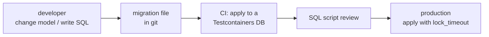

# Schema Migrations from .NET

> Every schema change is a versioned, reviewed, repeatable script — applied the same way on dev, CI, and production.



## Tools

| Tool | You write | Tracks applied scripts in | Good for |
|---|---|---|---|
| EF Core Migrations | C# model changes → generated C# | `__EFMigrationsHistory` | EF Core apps |
| DbUp | plain `.sql` files | `schemaversions` | SQL-first teams, Dapper apps |
| FluentMigrator | C# fluent API | `VersionInfo` | DB-agnostic C# |
| Flyway / sqitch | `.sql` files, CLI | own tables | polyglot teams |

## EF Core Migrations

```bash
dotnet tool install --global dotnet-ef
dotnet ef migrations add AddReviews --project samples/dotnet/03-EfCore
dotnet ef migrations script --idempotent -o migrate.sql     # review this file, apply it in CD
```

Existing database (like `shop`)? Create a **baseline**: add an initial migration, then insert its id into `__EFMigrationsHistory` instead of running it — so EF only applies changes after it.

### Safe changes need raw SQL

```csharp
public partial class AddOrdersStatusIndex : Migration
{
    protected override void Up(MigrationBuilder mb)
    {
        mb.Sql("SET lock_timeout = '3s';");
        // CONCURRENTLY can't run inside a transaction → suppressTransaction
        mb.Sql("CREATE INDEX CONCURRENTLY IF NOT EXISTS orders_status_idx ON orders (status);",
               suppressTransaction: true);
    }

    protected override void Down(MigrationBuilder mb) =>
        mb.Sql("DROP INDEX CONCURRENTLY IF EXISTS orders_status_idx;", suppressTransaction: true);
}
```

## DbUp — SQL files in order

```csharp
// package: dbup-postgresql

var result = DeployChanges.To
    .PostgresqlDatabase(connectionString)
    .WithScriptsEmbeddedInAssembly(typeof(Program).Assembly)   // 0001_add_reviews.sql, 0002_…
    .LogToConsole()
    .Build()
    .PerformUpgrade();
```

## Zero-downtime rules

| Change | ❌ Blocking way | ✅ Safe way |
|---|---|---|
| Add index | `CREATE INDEX` | `CREATE INDEX CONCURRENTLY` |
| Add FK / CHECK | `ADD CONSTRAINT …` | `… NOT VALID` then `VALIDATE CONSTRAINT` |
| Add NOT NULL column | with a volatile default | nullable → backfill in batches → `SET NOT NULL` |
| Rename column | rename while old code runs | add new → dual-write → switch reads → drop old |
| Any DDL | wait forever for a lock | `SET lock_timeout = '3s'` and retry |

Background: [17-best-practices](../17-best-practices/01-best-practices.md) · [06-04 locks](../06-transactions-mvcc/04-locks-deadlocks.md)

## Pitfall
❌ `context.Database.Migrate()` at app startup with 5 replicas → 5 instances race to migrate
✅ Run migrations once, as a separate CD step, over a **direct** connection (not PgBouncer)

Next → [14-benchmark](14-benchmark.md)
