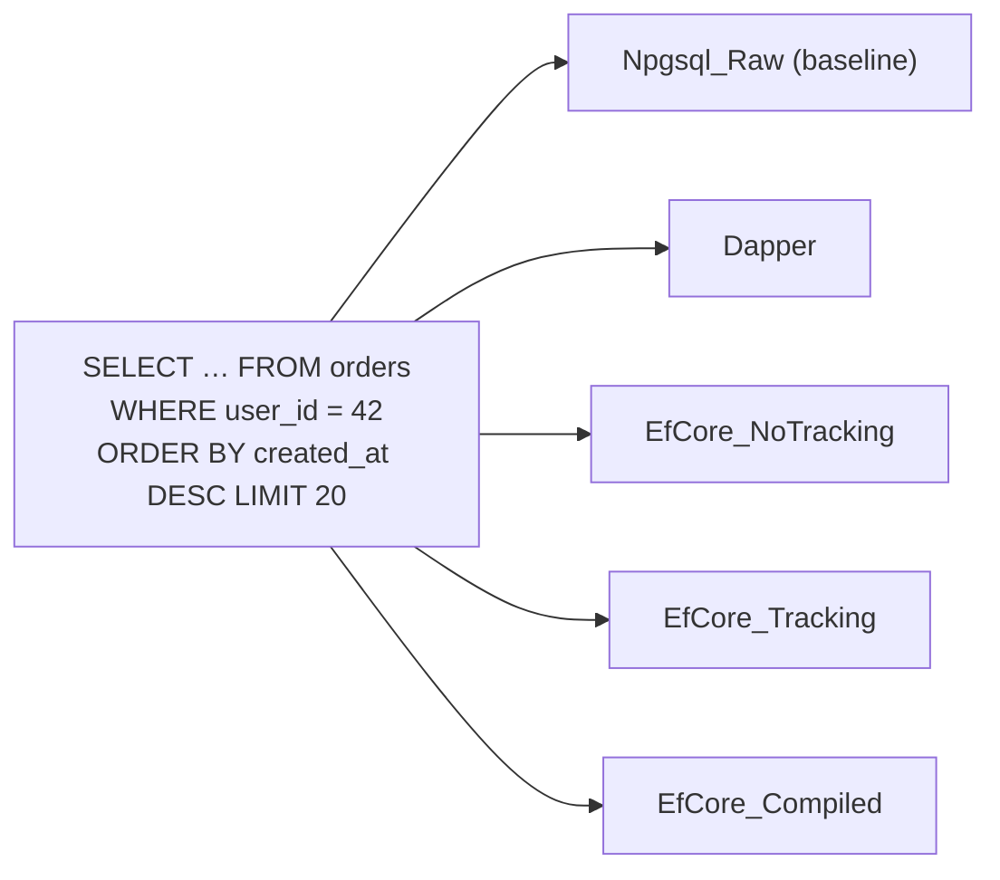

# Benchmark — Npgsql vs Dapper vs EF Core

> Same query five ways, measured with BenchmarkDotNet: "last 20 orders of user 42" on the 1M-row `shop` database.



## Code — [06-Benchmarks](../../samples/dotnet/06-Benchmarks/Program.cs)

```csharp
[MemoryDiagnoser]
public class LastOrdersOfUser
{
    [Benchmark(Baseline = true)] public async Task<int> Npgsql_Raw()        { /* reader loop */ }
    [Benchmark]                  public async Task<int> Dapper()            { /* QueryAsync<Order> */ }
    [Benchmark]                  public async Task<int> EfCore_NoTracking() { /* AsNoTracking().ToListAsync() */ }
    [Benchmark]                  public async Task<int> EfCore_Tracking()   { /* ToListAsync() */ }
    [Benchmark]                  public async Task<int> EfCore_Compiled()   { /* EF.CompileAsyncQuery */ }
}
```

Design choices:
- **Fixed user 42** → rows stay in `shared_buffers`; the difference measured is client-side overhead (mapping, tracking, translation), not disk.
- Requires the index from [samples/dotnet/sql/setup.sql](../../samples/dotnet/sql/setup.sql) (`orders_user_created_idx`); without it every variant is a ~340 ms seq scan and the differences disappear in noise.

## Run

```bash
docker compose up -d                                   # repo root
dotnet run --project samples/dotnet/01-Npgsql          # creates the index + functions once
dotnet run -c Release --project samples/dotnet/06-Benchmarks
```

## Results

**Not measured yet** — Docker was intentionally off while this phase was written. Paste your output here:

| Method | Mean | Ratio | Allocated |
|---|---|---|---|
| Npgsql_Raw | | 1.00 | |
| Dapper | | | |
| EfCore_NoTracking | | | |
| EfCore_Tracking | | | |
| EfCore_Compiled | | | |

What to look for when you read your numbers:

| Column | Question it answers |
|---|---|
| Mean | is the ORM overhead significant next to the network + query time? |
| Ratio | how far from raw Npgsql? |
| Allocated | GC pressure per call — matters at high RPS |

## Key Points
- Measure before choosing an ORM for speed
- Round-trip + query time usually dominates
- The right index beats any library choice

🏁 Next → [12-docker/01-image-volumes](../12-docker/01-image-volumes.md)
