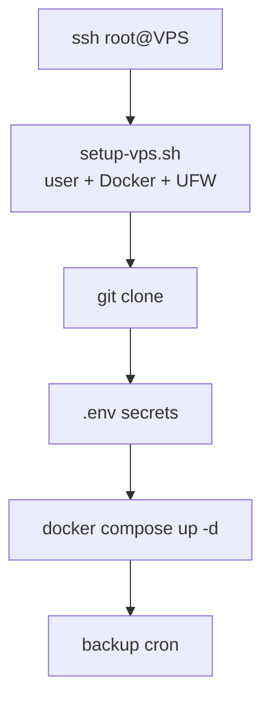
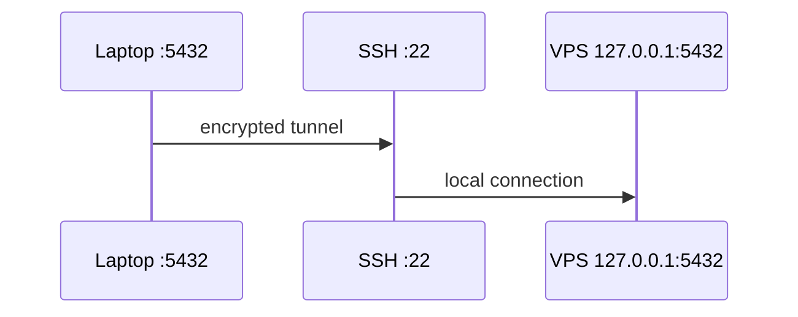

# Deploy on a VPS

> Fresh VPS (Ubuntu 24.04) → Docker → repo → `docker compose up -d`.



## Step 1 — Bootstrap (once)

```bash
ssh-copy-id root@VPS_IP    # from your laptop: the script refuses to run without a key
ssh root@VPS_IP
curl -fsSL https://raw.githubusercontent.com/wesamkhateeb98-creator/postgresql-zero-to-hero/main/deploy/setup-vps.sh -o setup-vps.sh
less setup-vps.sh          # read it before running it
bash setup-vps.sh deploy   # creates user "deploy"
```
[deploy/setup-vps.sh](../../deploy/setup-vps.sh): updates · user · Docker · UFW (SSH only) · 2 GB swap · SSH hardening.

## Step 2 — Deploy

```bash
ssh deploy@VPS_IP
git clone https://github.com/wesamkhateeb98-creator/postgresql-zero-to-hero.git /opt/pg
cd /opt/pg
cp .env.example .env
sed -i "s/change_me_app/$(openssl rand -hex 24)/" .env
docker compose up -d
docker compose ps          # pg → healthy
```

⚠️ This compose file is for **learning**. For a real app:

| Learning compose | Production |
|---|---|
| mounts `datasets/shop.sql` (1M fake rows) | remove the mount |
| mounts `./:/repo` (includes `.env`) | remove it |
| app connects as `app` (superuser) | non-superuser role ([08](../08-ops-scaling/01-roles-rls.md)) |
| `log_min_duration_statement=500` | keep ✅ |

## Step 3 — Connect from your laptop

```bash
ssh -N -L 5432:127.0.0.1:5432 deploy@VPS_IP     # terminal 1
psql -h localhost -U app -d shop                 # terminal 2
```



## VPS sizing

| Workload | vCPU / RAM | `shared_buffers` |
|---|---|---|
| Learning | 1 / 2 GB | 512MB |
| Small app | 2 / 4 GB | 1GB |
| Production | 4 / 8 GB+ | 2GB |

## Update

```bash
cd /opt/pg && git pull && docker compose up -d   # recreates only what changed
```

Next → [02-security](02-security.md)
