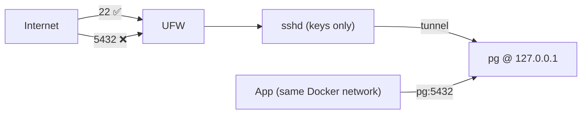

# VPS Security Checklist

> Most Postgres breaches = port 5432 open to the internet + a weak password.



## ⚠️ Docker vs UFW

```bash
# ❌ ports: "5432:5432"
ufw status               # 5432 not allowed...
nmap -p 5432 VPS_IP      # 5432/tcp open 😱  ← Docker wrote iptables rules directly

# ✅ ports: "127.0.0.1:5432:5432"
nmap -p 5432 VPS_IP      # 5432/tcp closed
```

## Checklist

| # | Item | Command / config |
|---|---|---|
| 1 | SSH keys only | `PasswordAuthentication no` |
| 2 | No root login | `PermitRootLogin no` |
| 3 | Firewall | `ufw default deny incoming && ufw allow OpenSSH` |
| 4 | Bind to localhost | `127.0.0.1:5432:5432` |
| 5 | Strong password | `openssl rand -hex 24` |
| 6 | App user is not superuser | [08-roles](../08-ops-scaling/01-roles-rls.md) |
| 7 | Automatic security updates | `apt install unattended-upgrades` |
| 8 | Brute-force protection | `apt install fail2ban` |
| 9 | Offsite backups | [03-backups-cron](03-backups-cron.md) |

Items 1–3, 7, 8 are done by [deploy/setup-vps.sh](../../deploy/setup-vps.sh).

## App on the same VPS

```yaml
services:
  api:
    image: my-api
    environment:
      DATABASE_URL: postgres://app:${PG_PASSWORD}@pg:5432/shop   # service name
```
No Postgres port needs to be published at all.

## Pitfall
❌ `POSTGRES_HOST_AUTH_METHOD=trust` → anyone connects without a password
✅ Keep the default (`scram-sha-256`)

Next → [03-backups-cron](03-backups-cron.md)
