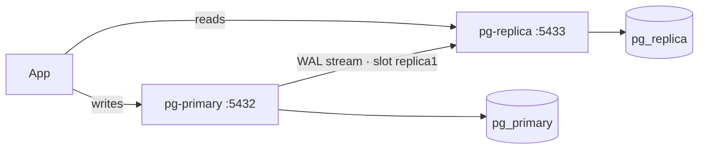
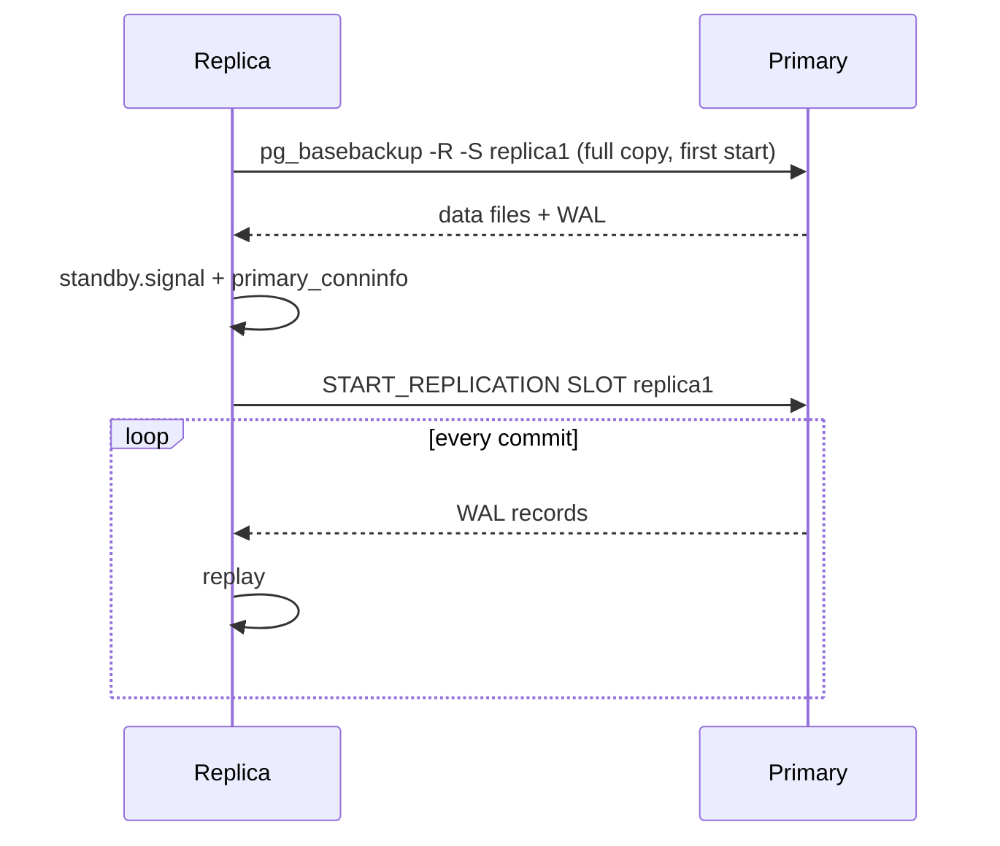

# Streaming Replication

> The primary writes → WAL is streamed live → the replica replays it (read-only hot standby).





## Files

| File | Role |
|---|---|
| [replication/docker-compose.yml](../../replication/docker-compose.yml) | primary + replica |
| [replication/init/01-replication.sh](../../replication/init/01-replication.sh) | `replicator` role + slot + pg_hba |
| [replication/.env.example](../../replication/.env.example) | passwords + ports |

## Run (verified)

```bash
cd replication
docker compose -f ../docker-compose.yml stop     # free port 5432
cp .env.example .env                             # PRIMARY_PORT / REPLICA_PORT if 5432 is taken
docker compose up -d                             # ~1 min (1M orders + pg_basebackup)
docker compose logs -f pg-replica
# ... "started streaming WAL from primary at 0/F000000 on timeline 1"
```
`port is already allocated`? → `docker ps --format '{{.Names}} {{.Ports}}' | grep 5432` and change `PRIMARY_PORT` in `.env`.

## Key settings

| Setting | On | Why |
|---|---|---|
| `wal_level=replica` | primary | WAL carries enough info |
| `max_wal_senders` | primary | ≥ number of replicas |
| `max_replication_slots` | primary | ≥ number of replicas |
| `hot_standby=on` | replica | allows reads |

## pg_basebackup flags

| Flag | Meaning |
|---|---|
| `-R` | writes `standby.signal` + `primary_conninfo` |
| `-Xs` | streams WAL during the copy |
| `-S replica1` | uses the slot |
| `-P` | progress |

## Async vs sync

| | Async (default) | Sync |
|---|---|---|
| COMMIT waits for replica | ❌ | ✅ |
| Data loss if primary dies | last ms | zero |
| Latency | ✅ | + network RTT |

Sync: `synchronous_standby_names = 'replica1'` + `application_name=replica1` in the conninfo.

Next → [02-verify-lag](02-verify-lag.md)
