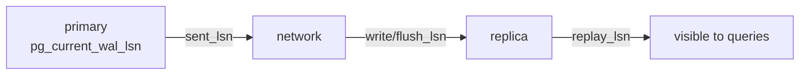

# Verify & Monitor Lag

> Confirm the replica is streaming, and measure how far behind it is.



## 1. Status on the primary (measured)

```bash
docker compose exec pg-primary psql -U app -d shop -c \
 "SELECT client_addr, state, sync_state, replay_lag FROM pg_stat_replication;"
#  client_addr | state     | sync_state | replay_lag
#  172.23.0.3  | streaming | async      | 00:00:00.29791
```

## 2. Replica is read-only (measured)

```bash
docker compose exec pg-replica psql -U app -d shop -c "SELECT pg_is_in_recovery();"   # t
docker compose exec pg-primary psql -U app -d shop -c "CREATE TABLE t(id int); INSERT INTO t VALUES (1);"
docker compose exec pg-replica psql -U app -d shop -c "SELECT * FROM t;"              # 1 ✅
docker compose exec pg-replica psql -U app -d shop -c "INSERT INTO t VALUES (2);"
# ERROR: cannot execute INSERT in a read-only transaction ✅
```

## 3. Lag

```sql
-- on the primary: bytes
SELECT application_name,
       pg_size_pretty(pg_wal_lsn_diff(pg_current_wal_lsn(), replay_lsn)) AS lag
FROM pg_stat_replication;

-- on the replica: time (0 when everything received has been applied)
SELECT CASE WHEN pg_last_wal_receive_lsn() = pg_last_wal_replay_lsn() THEN interval '0'
            ELSE now() - pg_last_xact_replay_timestamp() END AS replay_delay;
```
⚠️ `now() - pg_last_xact_replay_timestamp()` alone keeps growing while the primary is idle (measured: 20 s with 0 bytes lag) → false alarms.

## 4. Slots — disk danger

```sql
SELECT slot_name, active,
       pg_size_pretty(pg_wal_lsn_diff(pg_current_wal_lsn(), restart_lsn)) AS retained_wal
FROM pg_replication_slots;
--  replica1 | f | 12 GB   ← 🚨 replica is down and WAL keeps piling up
```

Protection (PG13+):
```sql
ALTER SYSTEM SET max_slot_wal_keep_size = '10GB';
SELECT pg_reload_conf();
```

## Load test on the replica

```bash
# custom read-only script (not -S: pgbench_* tables don't exist and you can't pgbench -i on a replica)
docker compose exec pg-replica pgbench -U app -n -c 20 -T 30 -f /bench/read_heavy.sql shop
```
Want the default `-S`? Run `pgbench -i -s 10` on the **primary** first; the tables replicate.

## Alerts

| Metric | Warn |
|---|---|
| `state` ≠ streaming | immediately |
| lag bytes | > 100 MB |
| `replay_delay` | > 30 s |
| slot `active = f` | > 5 min |

Next → [03-failover](03-failover.md)
