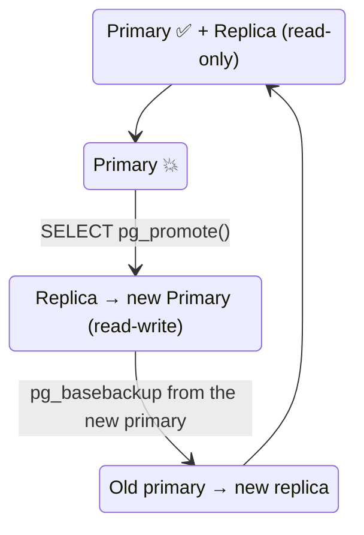

# Failover — Promote the Replica

> Primary is down → promote the replica → point the app at it.



## Drill (verified)

```bash
# 1. kill the primary
docker compose stop pg-primary

# 2. promote
docker compose exec pg-replica psql -U app -d shop -c "SELECT pg_promote();"          # t
docker compose exec pg-replica psql -U app -d shop -c "SELECT pg_is_in_recovery();"   # f ✅

# 3. writes work
docker compose exec pg-replica psql -U app -d shop -c "INSERT INTO t VALUES (99);"    # INSERT 0 1

# 4. app → :5433  (or switch DNS / HAProxy)
```

## Reset the lab

```bash
docker compose down -v && docker compose up -d     # simplest for learning
```
Production: the old primary **never comes back as primary** — rebuild it as a replica of the new one (`pg_basebackup` or `pg_rewind`).

## Manual vs automatic

| | Manual | Patroni / repmgr |
|---|---|---|
| Detect failure | you | automatic (etcd / consensus) |
| Promote | `pg_promote()` | automatic < 30 s |
| Split-brain protection | ❌ your job | ✅ fencing |
| Complexity | low | high |

## Key Points
- Promotion is final (new timeline)
- Rehearse failover before you need it
- Async → may lose the last few ms

## Pitfall
❌ Old primary restarts on its own while still primary → 2 primaries = **split-brain**
✅ `restart: "no"` on the old one, or fence it before promoting

Next → [04-two-vps](04-two-vps.md)
