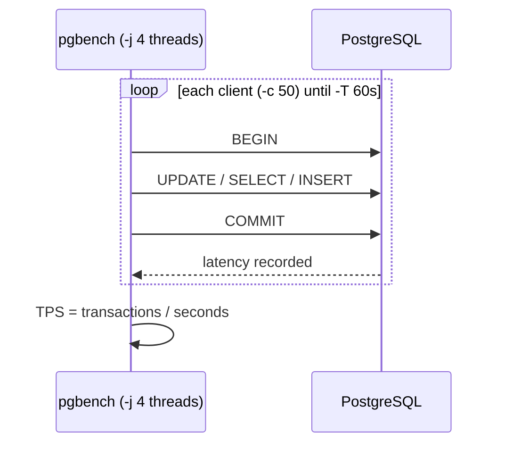

# pgbench Basics

> The official benchmark tool, shipped inside `postgres:17`. It runs N concurrent clients and measures TPS + latency.



## Tools compared

| Tool | Kind | Good for |
|---|---|---|
| **pgbench** ⭐ | built-in | OLTP + **your own SQL** |
| HammerDB | TPC-C / TPC-H | official engine comparisons |
| sysbench | generic | CPU / IO + DB |
| k6 / JMeter | HTTP | the whole app |

## Step 1 — Init

```bash
docker compose exec pg pgbench -U app -i -s 50 shop
```

| `-s` | rows in `pgbench_accounts` | Size |
|---|---|---|
| 1 | 100K | 16 MB |
| 50 | 5M | 750 MB |
| 500 | 50M | 7.5 GB |

## Step 2 — Run

```bash
docker compose exec pg pgbench -U app -c 50 -j 4 -T 60 -P 10 -M prepared -r shop
```

| Flag | Meaning |
|---|---|
| `-c 50` | concurrent clients |
| `-j 4` | threads (≈ cores) |
| `-T 60` | seconds |
| `-P 10` | progress every 10 s |
| `-M prepared` | prepared statements |
| `-r` | latency per statement |
| `-S` | SELECT only |
| `-N` | skip branch/teller updates |
| `-R 500` | fixed rate |

## Step 3 — Read

```text
progress: 10.0 s, 2410.3 tps, lat 20.7 ms stddev 8.1
latency average = 20.85 ms
tps = 2396.7 (without initial connection time)
statement latencies in milliseconds:
   0.61  UPDATE pgbench_accounts ...
  14.20  UPDATE pgbench_branches ...   ← 🔥 lock contention (only 50 branches)
```
(illustrative output — shape of the report)

## Key Points
- High `stddev` = spikes (checkpoints)
- `-r` finds the slow statement
- Default script = TPC-B-like (write heavy)

## Pitfall
❌ `-c 50` with `-s 1` → all clients fight over one branch row
✅ `-s` ≥ `-c`

Next → [02-custom-scripts](02-custom-scripts.md)
