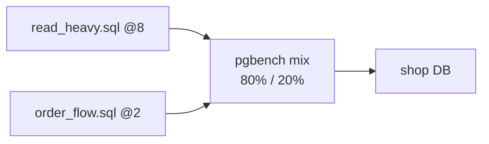

# Custom pgbench Scripts

> Benchmark **your app's queries** on the `shop` tables, not TPC-B.



## Scripts

- [bench/read_heavy.sql](../../bench/read_heavy.sql) — last 20 orders of a user
- [bench/order_flow.sql](../../bench/order_flow.sql) — checkout transaction

```sql
-- order_flow.sql
\set uid random(1, 100000)
\set pid random(1, 5000)
BEGIN;
SELECT price FROM products WHERE id = :pid;
INSERT INTO orders (user_id, product_id, qty) VALUES (:uid, :pid, 1);
UPDATE products SET stock = stock - 1 WHERE id = :pid;
COMMIT;
```

## Run (verified)

```bash
# /repo = this repo mounted inside the container
docker compose exec pg pgbench -U app -n -c 20 -j 4 -T 15 -P 5 \
  -f /repo/bench/read_heavy.sql@8 \
  -f /repo/bench/order_flow.sql@2 shop
# tps = 544  ·  read_heavy 16 ms avg  ·  order_flow 117 ms avg   (Docker Desktop)
```

| Syntax | Meaning |
|---|---|
| `\set x random(1, N)` | uniform |
| `random_zipfian(1, N, 1.1)` | hot keys (more realistic) |
| `:x` | use the variable |
| `-f file@8` | weight 8 |
| `-n` | don't vacuum pgbench tables |

## Before → after — index

| | `read_heavy` tps | avg latency |
|---|---|---|
| no `orders(user_id)` index | ~10–30 (estimate) | ~340+ ms (seq scan) |
| with `(user_id, created_at DESC)` | 4,997 (measured, 10 clients) | 2.0 ms |

## Key Points
- A script = a real scenario from the app
- `random_zipfian` = hot rows
- Always compare with the same `-c -T -s`

## Pitfall
❌ `order_flow` adds orders on every run → the table grows, runs aren't comparable
✅ `DELETE FROM orders WHERE id > 1000000; VACUUM orders;` between runs (or `down -v`)

Next → [03-ramp-and-monitor](03-ramp-and-monitor.md)
