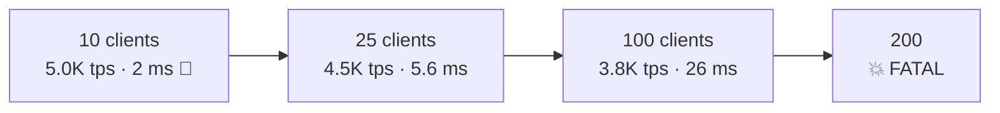
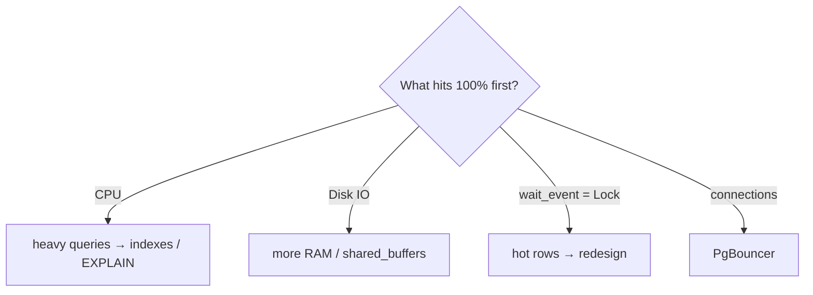

# Stress Test — Ramp Up & Monitor

> Add clients step by step until TPS stops growing or latency explodes = the server's limit.



## Run

```bash
docker compose exec pg bash /repo/bench/ramp.sh
docker compose exec -e CLIENTS="10 50 100" -e DURATION=60 pg bash /repo/bench/ramp.sh
```
[bench/ramp.sh](../../bench/ramp.sh)

Measured (Docker Desktop · 4 CPU · warm cache · `CLIENTS="10 25 50 100 200" DURATION=15`):
```text
script=read_heavy.sql  duration=15s  threads=4
clients=10   latency=2.001 ms     tps=4997   ← 🎯 sweet spot (~2.5× cores)
clients=25   latency=5.599 ms     tps=4465
clients=50   latency=13.732 ms    tps=3641   ← latency ×7, fewer tps!
clients=100  latency=26.078 ms    tps=3834
clients=200  💥 FATAL:  sorry, too many clients already   ← max_connections=100
```

Lesson: past ~2–3× the core count, more clients **lower** throughput (context switching + contention) → **PgBouncer** ([08](../08-ops-scaling/04-pgbouncer.md)), not a bigger `max_connections`.

⚠️ The first run after a restart hits a cold cache (mine: 1,018 tps instead of 4,997) → do a warm-up run and discard it.

## Monitor — second terminal

```bash
docker stats                                        # CPU / RAM
docker compose exec pg psql -U app -d shop -f /repo/bench/monitor.sql
```
[bench/monitor.sql](../../bench/monitor.sql) shows:

| Query | Look for |
|---|---|
| `pg_stat_activity` by wait_event | many `Lock` = contention · `IO` = disk |
| cache hit ratio | should be > 99% |
| `pg_stat_statements` top 5 | the query responsible |
| checkpoints | `num_requested` ≫ `num_timed` = `max_wal_size` too small |

## Bottleneck map



## Pitfall
❌ pgbench on the same server → steals CPU from Postgres
✅ Production-like: run it from another VPS (`-h <ip>`)

Next → [04-tuning-before-after](04-tuning-before-after.md)
