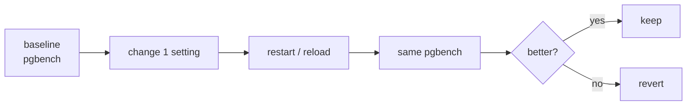

# Tuning — Before → After

> Change **one** setting → rerun the same benchmark → record the difference.



## Config — VPS 4 vCPU / 8 GB / SSD

```yaml
# docker-compose.yml → pg.command
command: >
  postgres
    -c shared_preload_libraries=pg_stat_statements
    -c shared_buffers=2GB
    -c effective_cache_size=6GB
    -c work_mem=16MB
    -c maintenance_work_mem=512MB
    -c max_wal_size=4GB
    -c checkpoint_completion_target=0.9
    -c random_page_cost=1.1
    -c effective_io_concurrency=200
```
```bash
docker compose up -d        # recreates the container with the new config
docker compose exec pg psql -U app -d shop -c "SHOW shared_buffers;"
```

## Settings

| Setting | Default | Tuned | Rule |
|---|---|---|---|
| `shared_buffers` | 128MB | 2GB | 25% of RAM |
| `effective_cache_size` | 4GB | 6GB | 75% of RAM (hint only) |
| `work_mem` | 4MB | 16MB | per sort/hash × connections! |
| `max_wal_size` | 1GB | 4GB | fewer checkpoints |
| `random_page_cost` | 4 | 1.1 | SSD |

## Results template

| Run | Change | TPS | avg ms | stddev |
|---|---|---|---|---|
| 0 | baseline | | | |
| 1 | `shared_buffers=2GB` | | | |
| 2 | + `max_wal_size=4GB` | | | |
| 3 | + `synchronous_commit=off` | | | |

Record your numbers in [bench/results.md](../../bench/results.md).

## Key Points
- PGTune (pgtune.leopard.in.ua) = a starting point
- `synchronous_commit=off` = speed vs losing the last ~600 ms
- The right index beats any tuning

## Pitfall
❌ `work_mem=1GB` with 100 connections → OOM
✅ Small globally, bigger per session: `SET work_mem = '256MB'` for reports

Next → [05-pgtap](05-pgtap.md)
