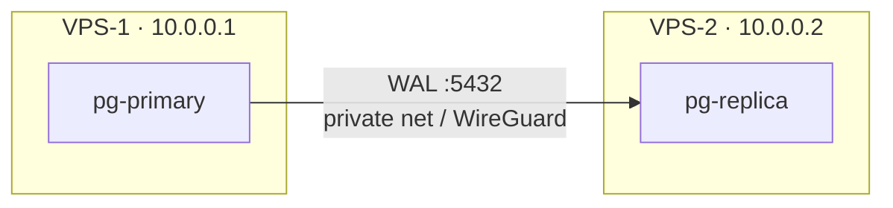

# Replica on a Second VPS (Production)

> Same idea, but the replica runs on another server over a private network — if VPS 1 dies, the data survives.



## Primary (VPS-1) — changes

```yaml
# replication/docker-compose.yml → pg-primary only
ports: ["10.0.0.1:5432:5432"]       # private IP, not 0.0.0.0
```
```bash
# pg_hba: replace "all" with the replica's IP (first matching line wins)
docker compose exec pg-primary bash -c \
  "sed -i 's#^host replication replicator all#host replication replicator 10.0.0.2/32#' \$PGDATA/pg_hba.conf"
docker compose exec pg-primary psql -U app -d shop -c "SELECT pg_reload_conf();"

ufw allow from 10.0.0.2 to any port 5432 proto tcp
```

## Replica (VPS-2) — `docker-compose.yml`

```yaml
services:
  pg-replica:
    image: postgres:17                 # exactly the same major
    user: postgres
    environment:
      PGPASSWORD: ${REPL_PASSWORD}
    entrypoint:
      - bash
      - -c
      - |
        if [ ! -s /var/lib/postgresql/data/PG_VERSION ]; then
          pg_basebackup -h 10.0.0.1 -U replicator \
            -D /var/lib/postgresql/data -Fp -Xs -P -R -S replica1
          chmod 0700 /var/lib/postgresql/data
        fi
        exec postgres
    volumes: [pg_replica:/var/lib/postgresql/data]
    ports: ["127.0.0.1:5432:5432"]
    restart: unless-stopped
volumes:
  pg_replica:
```

## Network options

| Option | Note |
|---|---|
| Provider private network (Hetzner / DO VPC) | easiest ✅ |
| WireGuard tunnel | any providers |
| Public IP + `hostssl` + firewall | last resort |

## Checklist

| # | Check |
|---|---|
| 1 | `nc -zv 10.0.0.1 5432` from VPS-2 ✅ |
| 2 | Same `postgres:17` on both |
| 3 | `pg_stat_replication` → `streaming` |
| 4 | Monitor lag + slots ([02](02-verify-lag.md)) |
| 5 | Backups still running ([12](../12-vps-deploy/03-backups-cron.md)) |

## Pitfall
❌ `ports: "5432:5432"` on the primary so the replica can reach it → open to the world
✅ Bind to the private IP + `ufw allow from 10.0.0.2`

Next → [14-benchmarking/01-pgbench-basics](../14-benchmarking/01-pgbench-basics.md)
