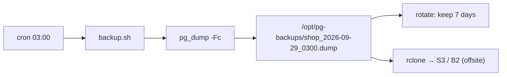

# Automated Backups

> Daily `pg_dump` via cron + delete old files + an offsite copy + a restore drill.



## Scripts

- [deploy/backup.sh](../../deploy/backup.sh) — dump + rotate
- [deploy/restore.sh](../../deploy/restore.sh) — restore into a new DB for testing

## Setup

```bash
chmod +x /opt/pg/deploy/*.sh
/opt/pg/deploy/backup.sh                         # try it manually first
ls -lh /opt/pg-backups/
# shop_2026-09-29_0300.dump

crontab -e                                       # as the deploy user
0 3 * * * /opt/pg/deploy/backup.sh >> /opt/pg-backups/backup.log 2>&1
```
Log goes to `/opt/pg-backups/` because `/var/log` is not writable by `deploy` — a failing redirect means the job silently never runs.

## Offsite (optional)

```bash
apt install rclone && rclone config           # remote named b2
# at the end of backup.sh:
rclone copy /opt/pg-backups b2:my-bucket/pg --max-age 24h
```

## Restore drill (monthly)

```bash
/opt/pg/deploy/restore.sh /opt/pg-backups/shop_2026-09-29_0300.dump shop_restore_test
docker compose exec pg psql -U app -d shop_restore_test -c "SELECT count(*) FROM orders;"
#  1000000 ✅
```

## Replication stack

```bash
COMPOSE_DIR=/opt/pg/replication SERVICE=pg-primary /opt/pg/deploy/backup.sh
```

## Pitfall
❌ `docker compose exec pg pg_dump > file` (without `-T`) → TTY characters corrupt the file
✅ `docker compose exec -T ...`

Next → [14-replication/01-streaming-replication](../14-replication/01-streaming-replication.md)
