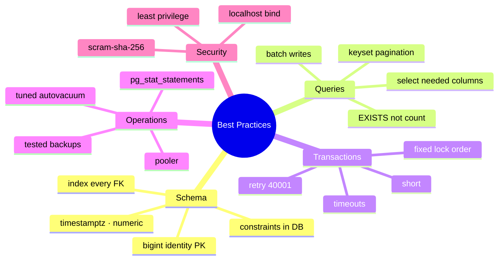

# Best Practices

> The short list that prevents most production incidents. Each row links back to the lesson that proves it.



## Schema

| ✅ Do | Why | Lesson |
|---|---|---|
| `bigint GENERATED ALWAYS AS IDENTITY` PKs | never runs out, SQL standard | [03-01](../03-data-modeling/01-data-types.md) |
| `timestamptz`, `numeric(p,s)`, `text` | correct time zones, exact money | [03-01](../03-data-modeling/01-data-types.md) |
| `NOT NULL` + `CHECK` + FK by default | DB enforces the rules, not only the app | [03-02](../03-data-modeling/02-constraints.md) |
| Index every FK column | fast joins + cascades | [03-02](../03-data-modeling/02-constraints.md) |
| `snake_case`, unquoted identifiers | no `"Quoted"` names forever | [00-02](../00-introduction/02-postgresql-vs-sql-server.md) |

## Queries & indexes

| ✅ Do | Why | Lesson |
|---|---|---|
| `EXPLAIN (ANALYZE, BUFFERS)` before optimizing | measure, don't guess | [05-01](../05-indexes-performance/01-explain.md) |
| Index for **queries**: equality cols first, range/sort last | one index serves filter + order | [05-02](../05-indexes-performance/02-btree.md) |
| Keyset pagination `WHERE id > $last` | 0.47 ms vs 3,429 ms at offset 900K (measured) | [02-anti-patterns](02-anti-patterns.md) |
| `EXISTS` for "is there any?" | 0.04 ms vs 288 ms for `count(*) > 0` (measured) | [02-anti-patterns](02-anti-patterns.md) |
| `INSERT … ON CONFLICT` / atomic `UPDATE x = x - 1` | race-free | [04-04](../04-advanced-sql/04-upsert.md) |
| `ANALYZE` after bulk loads & new expression indexes | correct row estimates | [07-04](../07-internals/04-planner-stats.md) |

## Transactions & migrations

```sql
-- per role / per session baseline
ALTER ROLE app_rw SET statement_timeout = '30s';
ALTER ROLE app_rw SET idle_in_transaction_session_timeout = '5min';

-- safe migration pattern
SET lock_timeout = '3s';
CREATE INDEX CONCURRENTLY orders_status_idx ON orders (status);
ALTER TABLE orders ADD CONSTRAINT qty_max CHECK (qty <= 100) NOT VALID;  -- instant
ALTER TABLE orders VALIDATE CONSTRAINT qty_max;                          -- no write lock
```

| ✅ Do | Lesson |
|---|---|
| Short transactions, no network calls inside | [06-01](../06-transactions-mvcc/01-acid.md) |
| Lock rows in a fixed order (`ORDER BY id FOR UPDATE`) | [06-04](../06-transactions-mvcc/04-locks-deadlocks.md) |
| Retry on `40001` / `40P01` | [06-02](../06-transactions-mvcc/02-isolation-levels.md) |

## Operations

| ✅ Do | Lesson |
|---|---|
| PgBouncer; `max_connections` ~100 | [08-04](../08-ops-scaling/04-pgbouncer.md) |
| `pg_stat_statements` always on | [09-03](../09-ecosystem/03-extensions.md) |
| Autovacuum on, tuned per big table | [07-03](../07-internals/03-vacuum.md) |
| Backups offsite + monthly restore drill | [11-03](../11-vps-deploy/03-backups-cron.md) |
| Monitor replication lag **and** slots | [12-02](../12-replication/02-verify-lag.md) |
| Pin the major version (`postgres:17`) | [10-01](../10-docker/01-image-volumes.md) |

## Security

| ✅ Do | Lesson |
|---|---|
| App role without superuser, least privilege | [08-01](../08-ops-scaling/01-roles-rls.md) |
| Bind `127.0.0.1` / private IP, SSH tunnel | [11-02](../11-vps-deploy/02-security.md) |
| `scram-sha-256`, never `trust` | [11-02](../11-vps-deploy/02-security.md) |

Next → [02-anti-patterns](02-anti-patterns.md)
