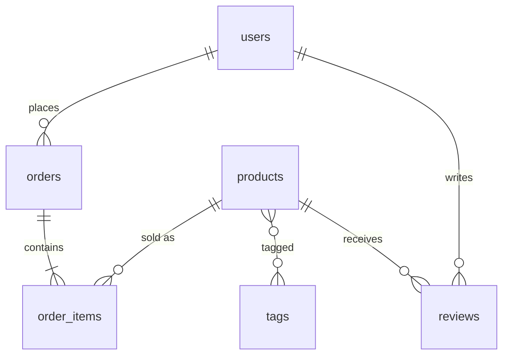
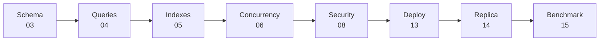

# 🏁 Capstone — E-commerce Database

> Put every phase together in one project: schema → performance → security → deploy → replica → benchmark.

## Tasks

### 1. Schema (03)
- [ ] `order_items (order_id, product_id, qty, unit_price)` — one order, many products
- [ ] `tags` + `product_tags` (many-to-many)
- [ ] `reviews` with `UNIQUE (user_id, product_id)` and `CHECK rating 1..5`
- [ ] `updated_at` trigger on products

### 2. Queries (04)
- [ ] Top 10 products by revenue, last 30 days
- [ ] Monthly revenue + growth % (`lag`)
- [ ] Cart upsert (`ON CONFLICT`)
- [ ] Product search: FTS on name + jsonb filter

### 3. Performance (05 · 07)
- [ ] Every query above < 10 ms (record `EXPLAIN ANALYZE` before/after)
- [ ] No unused indexes

### 4. Concurrency (06)
- [ ] Checkout never oversells stock under 100 concurrent clients
- [ ] Order-processing queue with `SKIP LOCKED`

### 5. Security & Ops (08)
- [ ] Roles: `app_rw`, `app_ro`, `reporting`
- [ ] RLS: a user sees only their orders
- [ ] `orders` partitioned by month
- [ ] Materialized view `daily_sales` + refresh

### 5b. .NET API (11)
- [ ] Minimal API on one `NpgsqlDataSource`: EF Core for writes, Dapper for reads
- [ ] Checkout endpoint with retry on `40001` / `40P01`
- [ ] Health check + OpenTelemetry traces showing each SQL span
- [ ] Testcontainers tests for every constraint + the concurrency test

### 6. Deploy (12 · 13 · 14)
- [ ] VPS + full security checklist
- [ ] Primary + replica on 2 VPSs
- [ ] Daily backup + successful restore drill
- [ ] Documented failover drill

### 7. Benchmark (15)
- [ ] pgbench scripts for checkout + browse
- [ ] Ramp test → find the sweet spot
- [ ] 3 tuning runs in [bench/results.md](../../bench/results.md)
- [ ] pgTAP tests for every constraint

### 8. Review (17)
- [ ] Walk through [best practices](../17-best-practices/01-best-practices.md) and [anti-patterns](../17-best-practices/02-anti-patterns.md)

## Definition of Done

| Metric | Target |
|---|---|
| Browse query p95 | < 10 ms |
| Checkout TPS (50 clients) | record it |
| Replica lag under load | < 1 s |
| Restore time | < 5 min |
| pgTAP | all green |

Next → [17-best-practices/01-best-practices](../17-best-practices/01-best-practices.md)
