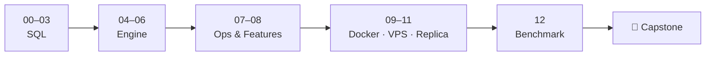
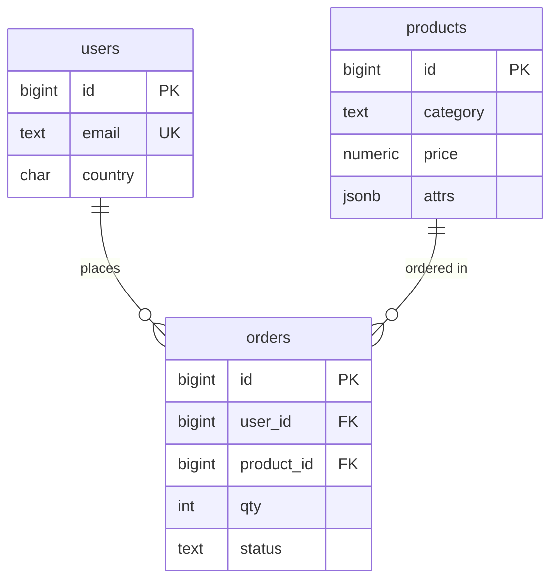

# PostgreSQL Zero → Hero

> من أول `SELECT` لحد Primary + Replica على VPS مع stress test. كل درس = diagram + SQL قابل للتشغيل على نفس الـ dataset.

## Big Picture



## Dataset (`datasets/shop.sql`)



| Table | Rows |
|---|---|
| users | 100K |
| products | 5K |
| orders | 1M |

## Quick Start

```bash
cp .env.example .env
docker compose up -d                      # أول مرة ~1 دقيقة لتحميل 1M order
docker compose exec pg psql -U app -d shop
\i /repo/01-sql-basics/lab.sql            # شغّل lab أي مرحلة
```

> **Windows + Git Bash:** Git Bash بيحوّل `/repo/...` لـ `C:/Program Files/Git/repo/...` بأي أمر `docker compose exec ... -f /repo/...`.
> الحل: `export MSYS_NO_PATHCONV=1` مرة وحدة بالـ terminal (أو استخدم PowerShell). `\i` جوا psql ما بيتأثر.
>
> **5432 محجوز؟** (Postgres ثاني شغّال) → `PG_PORT=15432` بالـ `.env`.

## Map

| # | Phase | Docs | Lab |
|---|---|---|---|
| 00 | Setup | [Docker setup](00-setup/docs/01-docker-setup.md) · [psql](00-setup/docs/02-psql-cheatsheet.md) | — |
| 01 | SQL Basics | [SELECT](01-sql-basics/docs/01-select-where.md) · [CRUD](01-sql-basics/docs/02-crud.md) · [JOINs](01-sql-basics/docs/03-joins.md) · [GROUP BY](01-sql-basics/docs/04-group-by.md) | [lab](01-sql-basics/lab.sql) |
| 02 | Data Modeling | [Types](02-data-modeling/docs/01-data-types.md) · [Constraints](02-data-modeling/docs/02-constraints.md) · [Normalization](02-data-modeling/docs/03-normalization.md) | [lab](02-data-modeling/lab.sql) |
| 03 | Advanced SQL | [CTE](03-advanced-sql/docs/01-cte.md) · [Window](03-advanced-sql/docs/02-window-functions.md) · [JSONB](03-advanced-sql/docs/03-jsonb.md) · [UPSERT](03-advanced-sql/docs/04-upsert.md) | [lab](03-advanced-sql/lab.sql) |
| 04 | Indexes & Performance | [EXPLAIN](04-indexes-performance/docs/01-explain.md) · [B-Tree](04-indexes-performance/docs/02-btree.md) · [Types](04-indexes-performance/docs/03-index-types.md) · [Partial/Covering](04-indexes-performance/docs/04-partial-covering.md) | [lab](04-indexes-performance/lab.sql) |
| 05 | Transactions & MVCC | [ACID](05-transactions-mvcc/docs/01-acid.md) · [Isolation](05-transactions-mvcc/docs/02-isolation-levels.md) · [MVCC](05-transactions-mvcc/docs/03-mvcc.md) · [Locks](05-transactions-mvcc/docs/04-locks-deadlocks.md) | [lab](05-transactions-mvcc/lab.sql) |
| 06 | Internals | [Pages](06-internals/docs/01-storage-pages.md) · [WAL](06-internals/docs/02-wal.md) · [VACUUM](06-internals/docs/03-vacuum.md) · [Planner](06-internals/docs/04-planner-stats.md) | [lab](06-internals/lab.sql) |
| 07 | Ops & Scaling | [Roles/RLS](07-ops-scaling/docs/01-roles-rls.md) · [Backup](07-ops-scaling/docs/02-backup-restore.md) · [Partitioning](07-ops-scaling/docs/03-partitioning.md) · [PgBouncer](07-ops-scaling/docs/04-pgbouncer.md) | [lab](07-ops-scaling/lab.sql) |
| 08 | Ecosystem | [Functions/Triggers](08-ecosystem/docs/01-functions-triggers.md) · [Views](08-ecosystem/docs/02-views-matviews.md) · [Extensions](08-ecosystem/docs/03-extensions.md) · [FTS](08-ecosystem/docs/04-full-text-search.md) | [lab](08-ecosystem/lab.sql) |
| 09 | Docker | [Image & Volumes](09-docker/docs/01-image-volumes.md) · [Compose](09-docker/docs/02-compose-healthcheck.md) | — |
| 10 | VPS Deploy | [Setup](10-vps-deploy/docs/01-vps-setup.md) · [Security](10-vps-deploy/docs/02-security.md) · [Backups](10-vps-deploy/docs/03-backups-cron.md) | [scripts](10-vps-deploy/scripts/) |
| 11 | Replication | [Streaming](11-replication/docs/01-streaming-replication.md) · [Verify/Lag](11-replication/docs/02-verify-lag.md) · [Failover](11-replication/docs/03-failover.md) · [2 VPS](11-replication/docs/04-two-vps.md) | [compose](11-replication/docker-compose.yml) |
| 12 | Benchmarking | [pgbench](12-benchmarking/docs/01-pgbench-basics.md) · [Custom](12-benchmarking/docs/02-custom-scripts.md) · [Ramp](12-benchmarking/docs/03-ramp-and-monitor.md) · [Tuning](12-benchmarking/docs/04-tuning-before-after.md) · [pgTAP](12-benchmarking/docs/05-pgtap.md) | [bench](12-benchmarking/bench/) |
| 🏁 | Capstone | [E-commerce backend](projects/ecommerce-backend/README.md) | — |

## Conventions

- كل doc < 2 دقائق قراءة، ينتهي بـ `Next →`
- الأرقام المعلّمة "مقاس" = Docker Desktop · 4 CPU · 8 GB · postgres:17؛ الباقي توضيحي — أرقامك رح تختلف
- `app` = superuser (للتعلّم فقط) — بالـ production شوف [07-roles](07-ops-scaling/docs/01-roles-rls.md)
- Reset كامل: `docker compose down -v && docker compose up -d`
