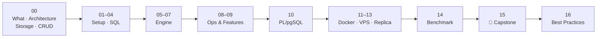
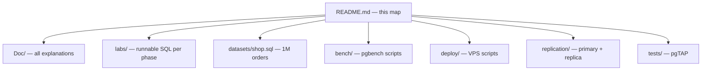
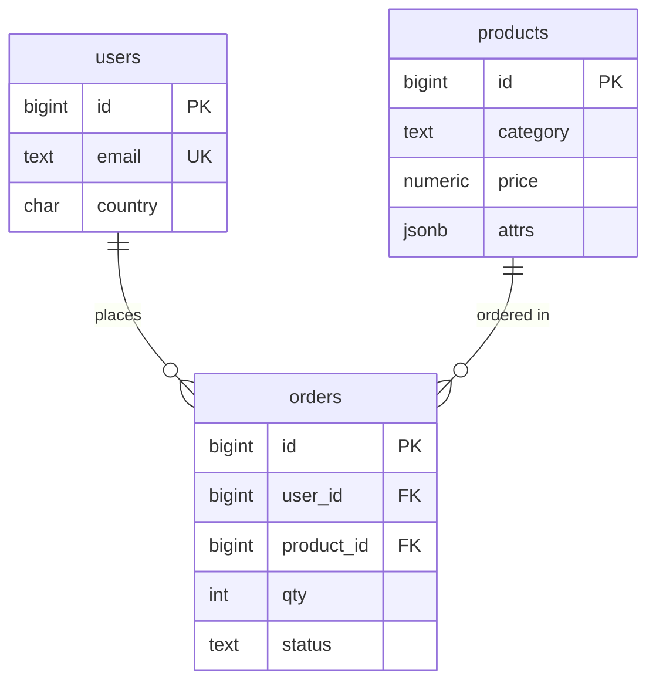

# PostgreSQL Zero → Hero

> From your first `SELECT` to a primary + replica on a VPS under stress test. Every lesson = diagram + runnable SQL on the same dataset.

## Big Picture



## Repo Layout



## Dataset (`datasets/shop.sql`)



| Table | Rows |
|---|---|
| users | 100K |
| products | 5K |
| orders | 1M |

## Quick Start

```bash
cp .env.example .env
docker compose up -d                      # first start ~1 min to load 1M orders
docker compose exec pg psql -U app -d shop
\i /repo/labs/02-sql-basics.sql           # run any phase's lab
```

> **Windows + Git Bash:** Git Bash rewrites `/repo/...` into `C:/Program Files/Git/repo/...` in any `docker compose exec ... -f /repo/...` command.
> Fix: `export MSYS_NO_PATHCONV=1` once per terminal (or use PowerShell). `\i` inside psql is not affected.
>
> **Port 5432 taken?** (another Postgres running) → set `PG_PORT=15432` in `.env`.

## Map

| # | Phase | Docs | Lab / Files |
|---|---|---|---|
| 00 | Introduction | [What is PostgreSQL](Doc/00-introduction/01-what-is-postgresql.md) · [vs SQL Server](Doc/00-introduction/02-postgresql-vs-sql-server.md) · [Architecture](Doc/00-introduction/03-architecture.md) · [Storage](Doc/00-introduction/04-storage-layout.md) · [CRUD internals](Doc/00-introduction/05-crud-internals.md) | — |
| 01 | Setup | [Docker setup](Doc/01-setup/01-docker-setup.md) · [psql](Doc/01-setup/02-psql-cheatsheet.md) | [compose](docker-compose.yml) |
| 02 | SQL Basics | [SELECT](Doc/02-sql-basics/01-select-where.md) · [CRUD](Doc/02-sql-basics/02-crud.md) · [JOINs](Doc/02-sql-basics/03-joins.md) · [GROUP BY](Doc/02-sql-basics/04-group-by.md) | [lab](labs/02-sql-basics.sql) |
| 03 | Data Modeling | [Types](Doc/03-data-modeling/01-data-types.md) · [Constraints](Doc/03-data-modeling/02-constraints.md) · [Normalization](Doc/03-data-modeling/03-normalization.md) | [lab](labs/03-data-modeling.sql) |
| 04 | Advanced SQL | [CTE](Doc/04-advanced-sql/01-cte.md) · [Window](Doc/04-advanced-sql/02-window-functions.md) · [JSONB](Doc/04-advanced-sql/03-jsonb.md) · [UPSERT](Doc/04-advanced-sql/04-upsert.md) | [lab](labs/04-advanced-sql.sql) |
| 05 | Indexes & Performance | [EXPLAIN](Doc/05-indexes-performance/01-explain.md) · [B-Tree](Doc/05-indexes-performance/02-btree.md) · [Types](Doc/05-indexes-performance/03-index-types.md) · [Partial/Covering](Doc/05-indexes-performance/04-partial-covering.md) | [lab](labs/05-indexes-performance.sql) |
| 06 | Transactions & MVCC | [ACID](Doc/06-transactions-mvcc/01-acid.md) · [Isolation](Doc/06-transactions-mvcc/02-isolation-levels.md) · [MVCC](Doc/06-transactions-mvcc/03-mvcc.md) · [Locks](Doc/06-transactions-mvcc/04-locks-deadlocks.md) | [lab](labs/06-transactions-mvcc.sql) |
| 07 | Internals | [Pages](Doc/07-internals/01-storage-pages.md) · [WAL](Doc/07-internals/02-wal.md) · [VACUUM](Doc/07-internals/03-vacuum.md) · [Planner](Doc/07-internals/04-planner-stats.md) | [lab](labs/07-internals.sql) |
| 08 | Ops & Scaling | [Roles/RLS](Doc/08-ops-scaling/01-roles-rls.md) · [Backup](Doc/08-ops-scaling/02-backup-restore.md) · [Partitioning](Doc/08-ops-scaling/03-partitioning.md) · [PgBouncer](Doc/08-ops-scaling/04-pgbouncer.md) | [lab](labs/08-ops-scaling.sql) |
| 09 | Ecosystem | [Functions/Triggers](Doc/09-ecosystem/01-functions-triggers.md) · [Views](Doc/09-ecosystem/02-views-matviews.md) · [Extensions](Doc/09-ecosystem/03-extensions.md) · [FTS](Doc/09-ecosystem/04-full-text-search.md) | [lab](labs/09-ecosystem.sql) |
| 10 | PL/pgSQL | [Basics](Doc/10-plpgsql/01-basics.md) · [Loops](Doc/10-plpgsql/02-loops.md) · [Functions](Doc/10-plpgsql/03-functions.md) · [Procedures](Doc/10-plpgsql/04-procedures.md) · [Errors](Doc/10-plpgsql/05-errors.md) · [Dynamic SQL](Doc/10-plpgsql/06-dynamic-sql.md) · [Triggers](Doc/10-plpgsql/07-triggers-deep.md) | [lab](labs/10-plpgsql.sql) |
| 11 | Docker | [Image & Volumes](Doc/11-docker/01-image-volumes.md) · [Compose](Doc/11-docker/02-compose-healthcheck.md) | — |
| 12 | VPS Deploy | [Setup](Doc/12-vps-deploy/01-vps-setup.md) · [Security](Doc/12-vps-deploy/02-security.md) · [Backups](Doc/12-vps-deploy/03-backups-cron.md) | [deploy/](deploy/) |
| 13 | Replication | [Streaming](Doc/13-replication/01-streaming-replication.md) · [Verify/Lag](Doc/13-replication/02-verify-lag.md) · [Failover](Doc/13-replication/03-failover.md) · [2 VPS](Doc/13-replication/04-two-vps.md) | [replication/](replication/docker-compose.yml) |
| 14 | Benchmarking | [pgbench](Doc/14-benchmarking/01-pgbench-basics.md) · [Custom](Doc/14-benchmarking/02-custom-scripts.md) · [Ramp](Doc/14-benchmarking/03-ramp-and-monitor.md) · [Tuning](Doc/14-benchmarking/04-tuning-before-after.md) · [pgTAP](Doc/14-benchmarking/05-pgtap.md) | [bench/](bench/) · [tests/](tests/) |
| 15 | Capstone | [E-commerce database](Doc/15-capstone/01-ecommerce-capstone.md) | — |
| 16 | Best Practices | [Best practices](Doc/16-best-practices/01-best-practices.md) · [Anti-patterns](Doc/16-best-practices/02-anti-patterns.md) | — |

## Conventions

- Every doc reads in < 3 minutes and ends with `Next →`
- Numbers marked **measured** = Docker Desktop · 4 CPU · 8 GB · postgres:17.11; the rest are illustrative — yours will differ
- `app` = superuser (learning only) — for production see [08-roles](Doc/08-ops-scaling/01-roles-rls.md)
- Full reset: `docker compose down -v && docker compose up -d`
