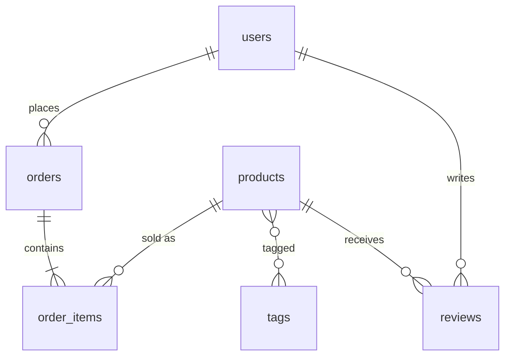
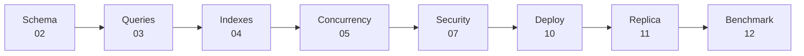

# 🏁 Capstone — E-commerce Database

> جمّع كل المراحل بمشروع واحد: schema → performance → security → deploy → replica → benchmark.

## Tasks

### 1. Schema (02)
- [ ] `order_items (order_id, product_id, qty, unit_price)` — order فيه عدة منتجات
- [ ] `tags` + `product_tags` (many-to-many)
- [ ] `reviews` مع `UNIQUE (user_id, product_id)` و `CHECK rating 1..5`
- [ ] `updated_at` trigger على products

### 2. Queries (03)
- [ ] Top 10 products revenue آخر 30 يوم
- [ ] Monthly revenue + growth % (`lag`)
- [ ] Cart upsert (`ON CONFLICT`)
- [ ] Product search: FTS على name + jsonb filter

### 3. Performance (04 · 06)
- [ ] كل query فوق < 10 ms (سجّل `EXPLAIN ANALYZE` قبل/بعد)
- [ ] ما في index غير مستخدم

### 4. Concurrency (05)
- [ ] Checkout ما بيبيع أكثر من الـ stock تحت 100 client متزامن
- [ ] Order processing queue بـ `SKIP LOCKED`

### 5. Security & Ops (07)
- [ ] Roles: `app_rw`, `app_ro`, `reporting`
- [ ] RLS: user بيشوف orders تبعه بس
- [ ] `orders` partitioned by month
- [ ] Materialized view `daily_sales` + refresh

### 6. Deploy (09 · 10 · 11)
- [ ] VPS + security checklist كامل
- [ ] Primary + replica على 2 VPS
- [ ] Daily backup + restore drill ناجح
- [ ] Failover drill موثّق

### 7. Benchmark (12)
- [ ] pgbench scripts لـ checkout + browse
- [ ] Ramp test → حدد الـ sweet spot
- [ ] 3 tuning runs بـ [results.md](../../12-benchmarking/results.md)
- [ ] pgTAP tests لكل constraint

## Definition of Done

| Metric | Target |
|---|---|
| Browse query p95 | < 10 ms |
| Checkout TPS (50 clients) | سجّل الرقم |
| Replica lag تحت load | < 1 s |
| Restore time | < 5 min |
| pgTAP | all green |
