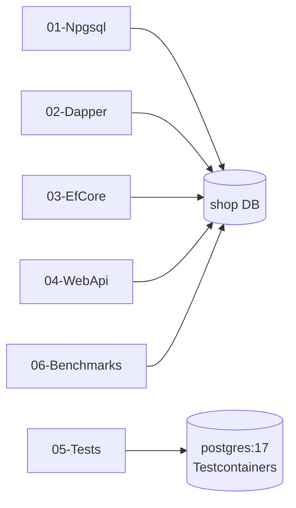

# .NET 10 + PostgreSQL Samples

> One project per approach, one layer each. Explanations: [Doc/11-dotnet](../../Doc/11-dotnet/01-overview.md).



| Project | Shows | Needs |
|---|---|---|
| [01-Npgsql](01-Npgsql/Program.cs) | parameters, transactions, arrays, jsonb, functions, binary COPY, LISTEN/NOTIFY | repo Postgres |
| [02-Dapper](02-Dapper/Program.cs) | QueryAsync, multi-mapping, jsonb handler, transactions | repo Postgres |
| [03-EfCore](03-EfCore/Program.cs) | DbContext on existing schema, jsonb, arrays, xmin concurrency, ExecuteUpdate, compiled query | repo Postgres (`--sql-only` needs nothing) |
| [04-WebApi](04-WebApi/Program.cs) | Minimal API, DI, one pool for Dapper + EF, retries, health checks, OpenTelemetry | repo Postgres |
| [05-Tests](05-Tests/ShopDbTests.cs) | xUnit + Testcontainers + Respawn, constraint and concurrency tests | Docker |
| [06-Benchmarks](06-Benchmarks/Program.cs) | Npgsql vs Dapper vs EF Core | repo Postgres, Release build |

## Run

```bash
# from the repo root: start Postgres with the 1M-order dataset
docker compose up -d

cd samples/dotnet
dotnet build                                       # verified: 0 warnings, 0 errors (.NET SDK 10.0.401)
dotnet run --project 01-Npgsql                     # also creates the functions + index from sql/setup.sql
dotnet run --project 02-Dapper
dotnet run --project 03-EfCore
dotnet run --project 03-EfCore -- --sql-only       # print EF's DDL + SQL, no database needed
dotnet run --project 04-WebApi                     # http://localhost:5175/products/1 · /users/42/orders · /health
dotnet test 05-Tests
dotnet run -c Release --project 06-Benchmarks
```

Connection string: env var `SHOP_DB` (console apps) or `ConnectionStrings:Shop` in [04-WebApi/appsettings.json](04-WebApi/appsettings.json). Default: `Host=localhost;Port=5432;Database=shop;Username=app;Password=change_me_app` — match your `.env`.

## Verification status

| Check | Result |
|---|---|
| `dotnet build -c Release` (all 6) | ✅ 0 warnings, 0 errors |
| `03-EfCore --sql-only` (model ↔ `shop.sql`) | ✅ table/column names and types match |
| Running against Postgres, tests, benchmarks | ⏳ not run — Docker was off by choice |
